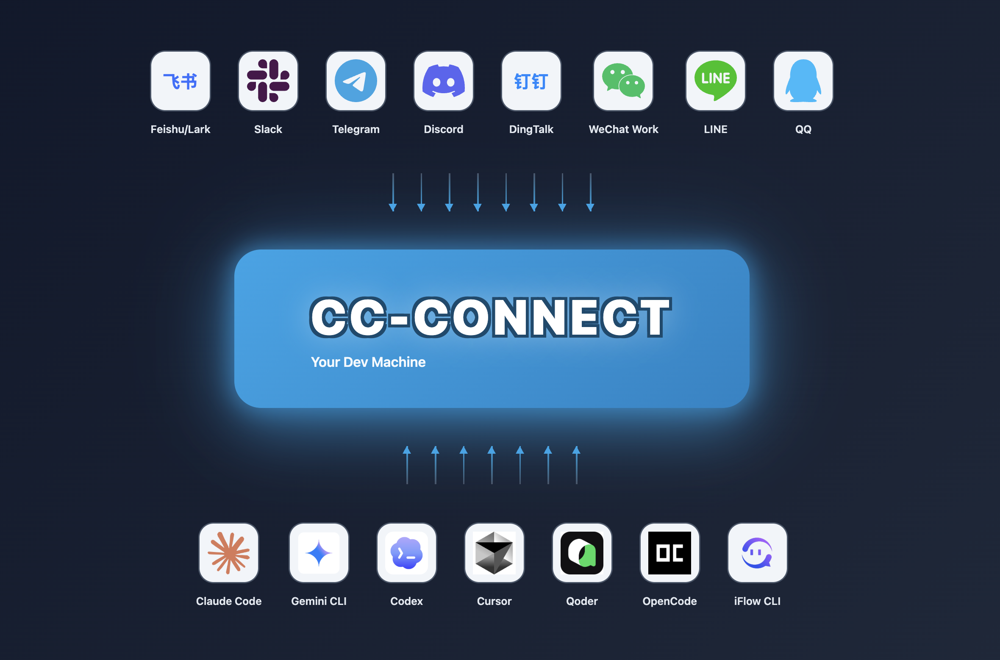
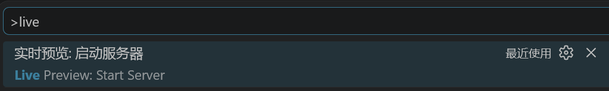
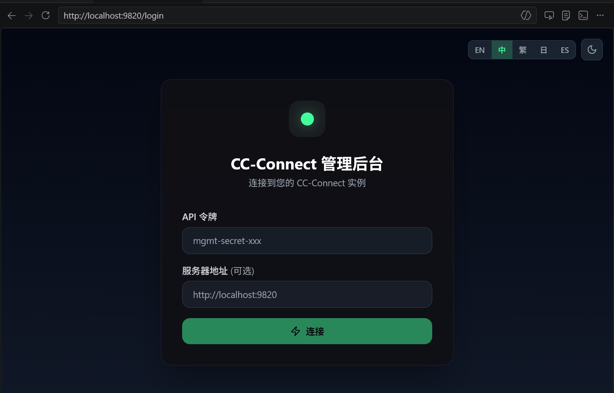
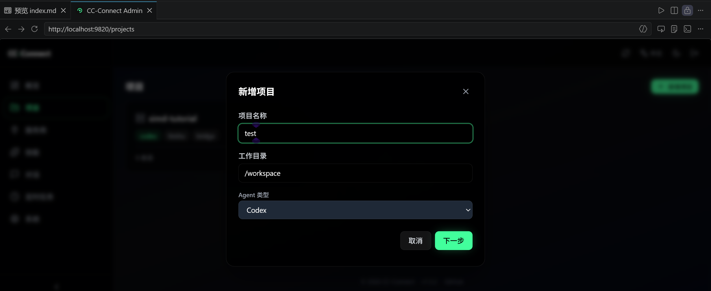
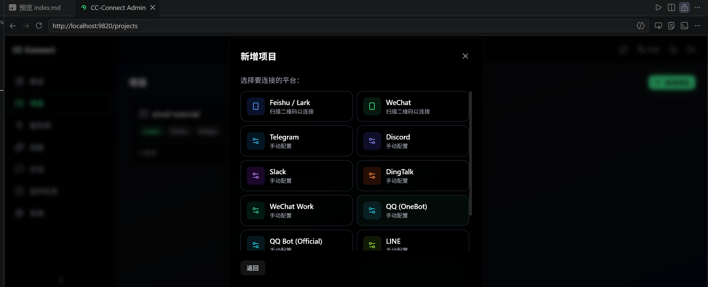
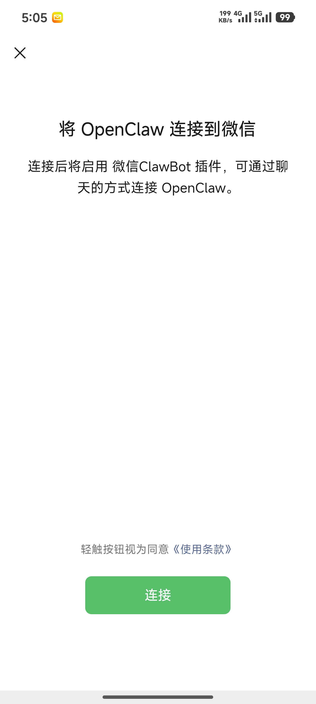
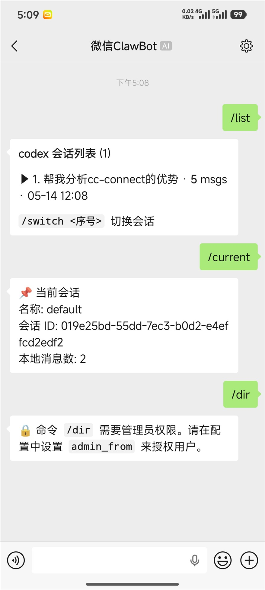
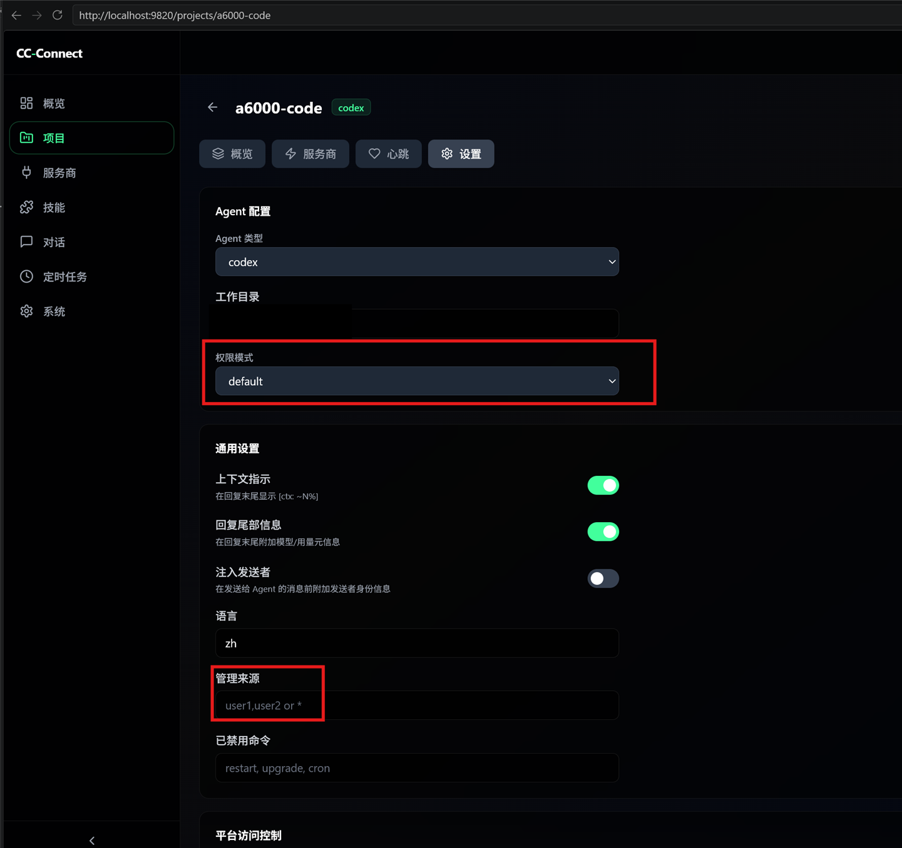

# cc-connect 接入微信个人号备忘

[cc-connect](https://github.com/chenhg5/cc-connect) 可以把运行在服务器的多个 AI Agent (支持`Claude Code、Codex、Cursor Agent、Kimi CLI、Qoder CLI、Gemini CLI、OpenCode、iFlow CLI、Pi、Devin`)接到多个聊天平台上的通用连接层，支持微信个人号、企业微信、飞书、钉钉、Slack、Telegram、Discord、LINE、微博和QQ等平台。实现流程是: 
```text
聊天平台 <-> cc-connect <-> Agent
```

参考官方架构图片：


## 1. 安装配置
可以通过`npm`安装，初次配置web配置界面**前后**都需要启动一次`cc-connect`命令

```bash
# 安装 cc-connect
➜ ✗ npm install -g cc-connect

# 首次运行前需要先运行cc-connect 产生默认配置文件
➜ ✗ cc-connect    
2026/05/14 11:23:27 INFO acquired instance lock path=/root/.cc-connect/.config.toml.lock
Created default config at /root/.cc-connect/config.toml
Please edit this file to add your agent and platform credentials, then run cc-connect again.

# 推荐优先用 Web UI 管理配置
➜ ✗ cc-connect web
Web admin is not enabled. Configuring...
Web admin configured on port 9820.
Restart cc-connect for the changes to take effect.
Opening: http://localhost:9820

➜ ✗ cc-connect  # 依旧需要启动cc-connect命令
```
## 1.1 配置
通过`Vscode`的`Live Preview`插件打开上面产生的`http://localhost:9820`地址，这里服务器是内网环境，直接在本地启动是不能访问的(或者可以通过`ssh -L 9820:localhost:9820 user@server`的方式把服务器的9820端口映射到本地).

`Live Preview`插件安装和使用可以参考[这篇文章](../vscode-markdown-preview/)，通过`ctrl+shift+p`打开`Vscode`命令面板，输入`Live Preview: Start Server`进行启动

在浏览器里打开地址`http://localhost:9820`，就可以看到配置界面了。

这里的`API令牌在`初次执行`cc-connect`命令时会自动生成在`~/.cc-connect/config.toml`文件中，格式如下，可以自己找到这个位置修改token
```toml
[management]
  enabled = true
  port = 9820
  token = "ababababababababab"
  cors_origins = ["*"]
```
`cc-connect v1.3.2`版本默认带一个飞书的项目，直接删除到没有项目状态会断开等重启但是报错，建议先不动。直接点击`项目` -> `新建项目`，输入项目名称、工作目录以及使用的Agent

接下来出现使用平台，这里可以直接选择微信个人号，后续会有微信扫码登录的流程(这一步也可以参考文档[docs/weixin.md](https://github.com/chenhg5/cc-connect/blob/main/docs/weixin.md)执行)。

使用个人微信扫码完后需要重启项目，随后手机微信出现授权

后续就可以在微信里和这个项目进行对话了。

在`项目` -> `设置`里可以设置管理员以及权限模式，这里的`管理来源`应该填入设置页面最下方的`平台访问控制`的id


## 1.2 使用

直接给机器人发消息即可，此外包括下面使用方法，详见[文档](https://github.com/chenhg5/cc-connect/blob/main/docs/usage.zh-CN.md)
```text
/new [名称]            创建新会话
/list                  列出所有会话
/switch <id>           切换会话
/current               查看当前会话
/dir [路径|reset]      查看、切换或重置工作目录
/mode             查看可用模式
/mode yolo        # 自动批准所有工具
/mode default     # 每次工具调用前询问
/model                      列出可用模型（格式：alias - model）
/model switch <alias>       按别名切换模型
/dir                         查看当前工作目录与历史
/dir <路径>                  切换到指定目录（相对或绝对路径）
/dir <序号>                  按历史序号切换
/dir -                       返回上一个目录
/cd <路径>                   `/dir <路径>` 的兼容别名
```

查看路径下文件需要使用`!ls`命令调用bash执行。

### 1.3 多工作区模式

!这东西用法很迷, 不知道想表达什么, ui界面也没有相关设置...

`cc-connect`提供 `multi-workspace` 模式 需要手动在配置文件`~/.cc-connect/config.toml`中找到对应项目名称 设置`mode`把`work_dir`修改成`base_dir`：

```toml
[[projects]]
name = "my-project"
mode = "multi-workspace"
base_dir = "~/workspaces"
```

配套命令包括：

- `/workspace`
- `/workspace bind <名称>`
- `/workspace init <git-url>`
- `/workspace list`

## 参考链接
- [cc-connect GitHub](https://github.com/chenhg5/cc-connect)
- [cc-connect GitHub](https://github.com/chenhg5/cc-connect)
