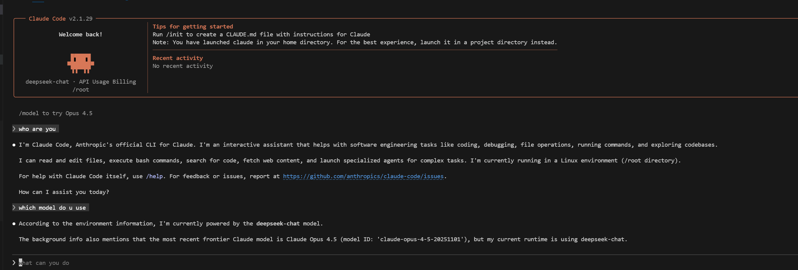
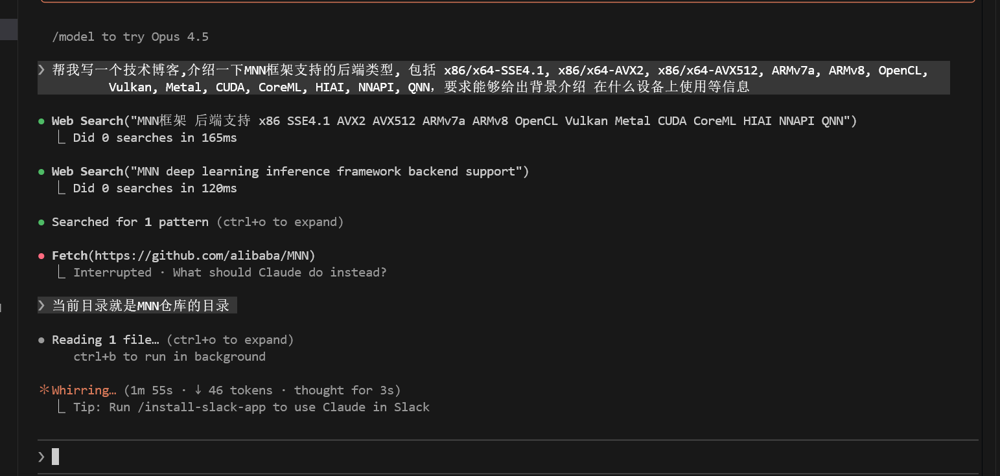

# Claude Code 配置指南

[Claude Code](https://github.com/anthropics/claude-code) 是 Anthropic 推出的一个本地运行的 Agent 框架，可以接入 Claude 或者兼容 Claude 的第三方模型，支持工具使用和技能配置。

下面是 **Ubuntu 22.04 系统** 的安装配置记录：

## 1. 安装 Claude Code

下载安装 `claude code` (需要魔法，[参考安装教程](https://www.runoob.com/ai-agent/claude-code.html))，并且为了使用第三方 API 需要禁用登录。

```bash
curl -fsSL https://claude.ai/install.sh | bash

vim ~/.claude.json
# 添加/修改下面内容为
# "hasCompletedOnboarding": true // 禁用登录

# 如果已经使用 claude 需要清理一下 ~/.claude.json 的备份
# rm -rf ~/.claude.json.*
```

## 2. 安装 cc-switch (可选)

`cc-switch` 是一个可以在 `claude code` 中同时管理并且切换不同的大模型 API，支持 Claude 和兼容 Claude 的第三方模型。

**注意：如果只使用 Claude 官方模型可以跳过这一步**

### 2.1 下载安装

[选择对应的 CLI 版本](https://github.com/SaladDay/cc-switch-cli)，下面具体获取的包需要在 [release 界面获取](https://github.com/SaladDay/cc-switch-cli/releases)，优先获取 musl 静态编译版。

```bash
# 下载
curl -LO https://github.com/SaladDay/cc-switch-cli/releases/download/v4.5.0/cc-switch-cli-v4.5.0-linux-x64-musl.tar.gz

tar -xzf cc-switch-cli-*.tar.gz # 解压
rm cc-switch-cli-*.tar.gz # 删除压缩包
chmod +x cc-switch # 执行权限
sudo mv cc-switch /usr/local/bin/ # 放到系统路径
```

### 2.2 配置 API

参考[文档](https://github.com/SaladDay/cc-switch-cli) (有[中文版](https://github.com/SaladDay/cc-switch-cli/blob/main/README_ZH.md))，输入对应的模型提供商、URL、模型 ID、接口令牌等信息。

```bash
➜  cc-switch provider list              # 列出所有供应商
No providers found.
Use 'cc-switch provider add' to create a new provider.

➜  ~ cc-switch provider add
Add New Provider
==================================================
> Provider Name: DeepSeek
> Website URL (optional): 
Generated ID: deepseek

Configure Claude Provider:
> API Key: ********************************
> Base URL: https://api.deepseek.com/anthropic
> Configure model names? Yes
> Default Model:： deepseek-chat
> Haiku Model:： deepseek-chat
> Sonnet Model:： deepseek-chat
> Opus Model:： deepseek-chat
> Configure optional fields (notes, sort index)? Yes

Optional Fields Configuration:
> Notes: 
> Sort Index: 

=== Provider Configuration Summary ===
ID: deepseek
Provider Name:: DeepSeek

Core Configuration:
  API Key: sk-0...841d
  Base URL: https://api.deepseek.com/anthropic
  Model: deepseek-chat
======================
? 
Confirm create this provider? (y/N) y 

# 再查看就有了
➜  cc-switch provider list                                     
┌───┬──────────┬──────────┬────────────────────────────────────┐
│   ┆ ID       ┆ Name     ┆ API URL                            │
╞═══╪══════════╪══════════╪════════════════════════════════════╡
│ ✓ ┆ deepseek ┆ DeepSeek ┆ https://api.deepseek.com/anthropic │
└───┴──────────┴──────────┴────────────────────────────────────┘

ℹ Application: claude
→ Current: deepseek # 当前使用的 deepseek

# 在打开 claude 就可以使用了
➜ claude
```

模型的 URL、ID、Token 令牌等获取参考 Copilot 配置文档。这里配置的 [DeepSeek 模型](https://api-docs.deepseek.com/zh-cn/guides/anthropic_api)，下面是加入 Claude Code 的测试结果：



## 3. 配置 Skills

可以在开源仓库/社区获取 Skills，如：

- [官方 Skills](https://github.com/anthropics/skills)
- [Awesome Claude Skills](https://github.com/ComposioHQ/awesome-claude-skills)
- [skillsmp](https://skillsmp.com/)
- [skills.sh](https://skills.sh/)

### 3.1 Skill 结构

Skill 包含如下结构，可以理解为高级提示词。参考教程: [官方文档](https://support.claude.com/en/articles/12512180-using-skills-in-claude-code)、[中文教程](https://www.runoob.com/ai-agent/skills-agent.html)

```
skill-name/
├── SKILL.md          # Required: Skill instructions and metadata
├── scripts/          # Optional: Helper scripts
├── templates/        # Optional: Document templates
└── resources/        # Optional: Reference files
```

### 3.2 安装 Skill

把下载好的 Skill 放到下面目录就可以在 Claude Code 中使用：

```bash
mkdir -p ~/.config/claude-code/skills/
cp -r skill-name ~/.config/claude-code/skills/
```

下面以 https://skillsmp.com/skills/tldraw-tldraw-claude-skills-write-tbp-skill-md 为例，右边有 install 命令：

```bash
➜  npx skills add tldraw/tldraw # 中间的命令通过方向键和空格键选中
➜  ls -lah /root/.claude/skills # 可以在 skills 目录下查找到对应的 skills
total 8.0K
drwxr-xr-x 2 root root 4.0K Feb  3 19:34 .
drwxr-xr-x 9 root root 4.0K Feb  3 19:36 ..
lrwxrwxrwx 1 root root   32 Feb  3 19:34 find-skills -> ../../.agents/skills/find-skills
lrwxrwxrwx 1 root root   32 Feb  3 19:34 review-docs -> ../../.agents/skills/review-docs
lrwxrwxrwx 1 root root   34 Feb  3 19:34 skill-creator -> ../../.agents/skills/skill-creator
lrwxrwxrwx 1 root root   41 Feb  3 19:34 update-release-notes -> ../../.agents/skills/update-release-notes
lrwxrwxrwx 1 root root   32 Feb  3 19:34 write-docs -> ../../.agents/skills/write-docs
...
```

### 3.3 测试

第一次使用会询问工具权限，如果不应该使用工具可以附上应该怎么做，例如 `Fetch(https://github.com/alibaba/MNN)` 这一步被取消了，理由是当前目录就在 MNN 中。


