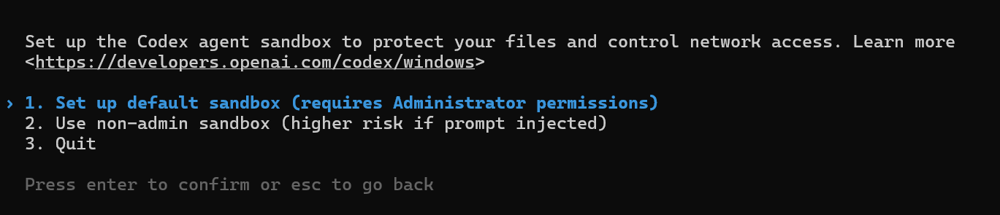

# Codex CLI 第三方 API 配置备忘

[Codex CLI](https://github.com/openai/codex) 是 OpenAI 官方推出的终端 AI Agent 工具，支持代码生成、文件操作等。本文记录如何配置第三方 api。

## 1. 安装

```bash
# 使用 npm 安装
npm install -g @openai/codex

# 验证安装
codex --version
# codex-cli 0.117.0 # 输出版本 安装成功

# linux 环境下
# 如果索引不到codex命令，可以尝试以下命令
# 激活nvm
echo '
export NVM_DIR="$HOME/.nvm"
[ -s "$NVM_DIR/nvm.sh" ] && \. "$NVM_DIR/nvm.sh"' >> ~/.zshrc
export NVM_DIR="$HOME/.nvm"
[ -s "$NVM_DIR/nvm.sh" ] && \. "$NVM_DIR/nvm.sh"
[ -s "$NVM_DIR/bash_completion" ] && \. "$NVM_DIR/bash_completion"
nvm --version # 验证nvm
export NVM_NODEJS_ORG_MIRROR=https://npmmirror.com/mirrors/node # 设置镜像源
# 如果nodejs版本过低，可以使用nvm安装最新版本的nodejs
nvm install 20 # 安装nodejs 20版本
```

## 2. cc-switch 配置第三方 API
### 2.1 安装 cc-switch

- [windows cli版本](https://github.com/SaladDay/cc-switch-cli/releases)安装演示如下，[release 界面获取](https://github.com/SaladDay/cc-switch-cli/releases)复制对应的下载版本连接，参考下面内容：
```pwsh
# 1. 创建临时目录并下载最新版
$downloadUrl = "https://github.com/SaladDay/cc-switch-cli/releases/latest/download/cc-switch-cli-windows-x64.zip"
$zipPath = "$env:TEMP\cc-switch-cli.zip"
$extractPath = "$env:TEMP\cc-switch-extract"
Invoke-WebRequest -Uri $downloadUrl -OutFile $zipPath

# 2. 解压
Expand-Archive -Path $zipPath -DestinationPath $extractPath -Force

# 3. 移动到用户 PATH 目录（无需管理员权限）
$binPath = "$env:LOCALAPPDATA\Microsoft\WindowsApps"
if (!(Test-Path $binPath)) { New-Item -ItemType Directory -Path $binPath -Force }
Copy-Item "$extractPath\cc-switch.exe" -Destination $binPath -Force

# 4. 验证安装
cc-switch --version
# cc-switch 5.2.1 # 输出版本 安装成功
```
- [Linux CLI 版本](https://github.com/SaladDay/cc-switch-cli)，下面具体获取的包需要在 [release 界面获取](https://github.com/SaladDay/cc-switch-cli/releases)，优先获取 musl 静态编译版。

```bash
# 1. 下载解压方式
curl -LO https://github.com/SaladDay/cc-switch-cli/releases/download/v4.5.0/cc-switch-cli-v4.5.0-linux-x64-musl.tar.gz

tar -xzf cc-switch-cli-*.tar.gz # 解压
rm cc-switch-cli-*.tar.gz # 删除压缩包
chmod +x cc-switch # 执行权限
sudo mv cc-switch /usr/local/bin/ # 放到系统路径


# 2. 直接脚本安装方式
curl -fsSL https://github.com/SaladDay/cc-switch-cli/releases/latest/download/install.sh | bash
```

### 2.2 设置 API Key
参考[文档](https://github.com/SaladDay/cc-switch-cli) (有[中文版](https://github.com/SaladDay/cc-switch-cli/blob/main/README_ZH.md))，输入对应的模型提供商、URL、模型 ID、接口令牌等信息。**部分自己搭建的第三方api的`base_url`需要加`/v1`，不然请求可能会自动路由到`/login`的返回界面**

```bash
➜  cc-switch --app codex provider add # 添加新供应商 这里需指定app为codex
Add New Provider
==================================================
> Select provider type: Add Third-Party Provider
> Provider Name: example
> Website URL (opt.):
Generated ID: example

Configure Codex Provider:
> OpenAI API Key: sk-abababababababababababababab
> Base URL: http://example.com/v1 # 注意这里部分自建站点需要加/v1 同时注意这里的协议
> Model: gpt-5.3-codex
> Configure optional fields (notes,  sort index)? No

=== Provider Configuration Summary ===
ID: example
Provider Name:: example

Core Configuration:
  API Key: sk-b...ecdf
  Config (TOML): 10 lines
======================
>
Confirm create this provider? Yes

✓ Successfully added provider 'example' 

# 再查看就有了
➜  cc-switch provider list --app codex # 同样指定codex                                    
┌───┬──────────┬──────────┬────────────────────────────────────┐
│   ┆ ID       ┆ Name     ┆ API URL                            │
╞═══╪══════════╪══════════╪════════════════════════════════════╡
│ ✓ ┆ example  ┆ example  ┆ http://example.com/v1              │
└───┴──────────┴──────────┴────────────────────────────────────┘

ℹ Application: codex
→ Current: example # 当前使用的 example

# 在打开 codex 就可以使用了
➜ codex
```

### 2.3 配置 Skill

Skill 包含如下结构，可以理解为高级提示词。参考tutorial: [官方文档](https://support.claude.com/en/articles/12512180-using-skills-in-claude-code)、[中文tutorial](https://www.runoob.com/ai-agent/skills-agent.html)

```
skill-name/
├── SKILL.md          # Required: Skill instructions and metadata
├── scripts/          # Optional: Helper scripts
├── templates/        # Optional: Document templates
└── resources/        # Optional: Reference files
```

可以在开源仓库/社区获取 Skills，如：

- [Awesome Claude Skills](https://github.com/ComposioHQ/awesome-claude-skills)
- [skillsmp](https://skillsmp.com/)
- [skills.sh](https://skills.sh/)

把下载好的 Skill 放到 Codex CLI 的 skills 目录就可以在 Codex CLI 中通过`/skills`命令启用：

下面以 [matplotlib](https://skills.sh/davila7/claude-code-templates/matplotlib) 为例，右边有 install 命令：

```bash
➜  npx skills add https://github.com/davila7/claude-code-templates --skill matplotlib
```
安装完成后可以导入`cc-switch`中统一管理：

```bash
# 扫描未管理的技能
➜ cc-switch skills scan-unmanaged  --app codex 
┌─────────────┬──────────┬─────────────┐
│ Directory   ┆ Found In ┆ Name        │
╞═════════════╪══════════╪═════════════╡
│ find-skills ┆ agents   ┆ find-skills │
├╌╌╌╌╌╌╌╌╌╌╌╌╌┼╌╌╌╌╌╌╌╌╌╌┼╌╌╌╌╌╌╌╌╌╌╌╌╌┤
│ matplotlib  ┆ agents   ┆ matplotlib  │
└─────────────┴──────────┴─────────────┘

# 导入到cc-switch中统一管理
➜ cc-switch skills import-from-apps find-skills
✓ Imported 1 skill(s) into SSOT
➜ cc-switch skills import-from-apps matplotlib
✓ Imported 1 skill(s) into SSOT

# 查看已导入的技能
➜ cc-switch skills list            
┌─────────────┬─────────────┬────────┬───────┬────────┬──────────┐
│ Directory   ┆ Name        ┆ Claude ┆ Codex ┆ Gemini ┆ OpenCode │
╞═════════════╪═════════════╪════════╪═══════╪════════╪══════════╡
│ find-skills ┆ find-skills ┆        ┆       ┆        ┆          │
├╌╌╌╌╌╌╌╌╌╌╌╌╌┼╌╌╌╌╌╌╌╌╌╌╌╌╌┼╌╌╌╌╌╌╌╌┼╌╌╌╌╌╌╌┼╌╌╌╌╌╌╌╌┼╌╌╌╌╌╌╌╌╌╌┤
│ matplotlib  ┆ matplotlib  ┆        ┆       ┆        ┆          │
└─────────────┴─────────────┴────────┴───────┴────────┴──────────┘

# 通过cc-switch启用技能
➜ cc-switch skills enable matplotlib --app codex
✓ Enabled 'matplotlib' for codex
➜ cc-switch skills enable find-skills --app codex
✓ Enabled 'find-skills' for codex
➜ cc-switch skills list 
┌─────────────┬─────────────┬────────┬───────┬────────┬──────────┐
│ Directory   ┆ Name        ┆ Claude ┆ Codex ┆ Gemini ┆ OpenCode │
╞═════════════╪═════════════╪════════╪═══════╪════════╪══════════╡
│ find-skills ┆ find-skills ┆        ┆ ✓     ┆        ┆          │
├╌╌╌╌╌╌╌╌╌╌╌╌╌┼╌╌╌╌╌╌╌╌╌╌╌╌╌┼╌╌╌╌╌╌╌╌┼╌╌╌╌╌╌╌┼╌╌╌╌╌╌╌╌┼╌╌╌╌╌╌╌╌╌╌┤
│ matplotlib  ┆ matplotlib  ┆        ┆ ✓     ┆        ┆          │
└─────────────┴─────────────┴────────┴───────┴────────┴──────────┘
```

## 3 Codex 使用
```bash
# 启动交互模式
codex
```
第一次启动需要选择运行模式，建议使用沙盒模式`Set up default sandbox`，隔离环境更安全。


### 3.1 基本使用

```bash
# 启动交互模式
codex

# 指定模型
codex --model gpt-4o

# 执行单条命令
codex "创建一个 Python 脚本读取 JSON 文件"

# 非交互模式（自动执行）
codex --full-auto "帮我重构这个函数"
```

### 3.2 常用命令
```bash
/resume     # 恢复上次会话
/ps         # 查看后台terminal
/stop       # 停止后台terminal
/approvals  # 授权
/skills     # 管理技能
/models     # 切换模型 这里可以调整思考模式 例如high extrahigh
/statusline # 状态底栏的显示 空格选中 enter保存 esc取消
```

## 4. rtk

[rtk](https://www.rtk-ai.app/) 在命令输出进入上下文窗口之前对其进行压缩。 更好的推理。更长的会话。更低的成本。

### 4.1 Linux

`rtk` 的 shell hook 能自动把常见命令重写成 `rtk ...`，并根据结果压缩上下文。

```bash
# 快速安装
curl -fsSL https://raw.githubusercontent.com/rtk-ai/rtk/refs/heads/master/install.sh | sh

# 初始化 Codex
rtk init -g --codex

# 重启 codex 后测试
rtk --version
rtk gain
```

### 4.2 Windows 原生 PowerShell

Windows 原生也能用 `rtk`，需要下载解压预编译包`rtk-x86_64-pc-windows-msvc.zip`,
- 对 Codex 的集成方式是 `rtk init -g --codex`
- Codex 这一项的官方集成方式是 `AGENTS.md + RTK.md instructions`

也就是说，对 Codex 而言，核心是给 Codex 注入使用 `rtk` 的规则，而不是依赖 bash hook。

安装步骤：

```powershell
# 1. 下载 release 里的 Windows 压缩包
# https://github.com/rtk-ai/rtk/releases

# 2. 解压后把 rtk.exe 放进 PATH
# 例如：C:\Users\xxx\.local\bin

# 3. 验证
rtk --version

# 4. 初始化 Codex
rtk init -g --codex

# 5. 重启 Codex 后查看统计
rtk gain
```

### 4.3 常用命令

```bash
# rtk 包装命令
rtk git status
rtk git diff
rtk find . -n '*.md'
rtk grep 'pattern' .
rtk read README.md
# 查看rtk压缩收益
rtk gain
```

更多命令与支持矩阵见：[rtk仓库](https://github.com/rtk-ai/rtk)

## 5. 避免命令污染

### 5.1 Linux(zsh)

`codex` 执行命令也会记录在 `zsh` 历史中，污染平时使用的`shell`命令。Linux 下可以把 `codex` 执行的命令单独写到隔离的 `HISTFILE`，再按需清理旧历史, 整理脚本如下：

 
```bash
git clone https://github.com/huluhuluu/useful-sh.git
./sh/codex-zsh-history-isolation/codex-zsh-history-isolation.sh # 设置修改codex命令隔离

# 可选 清理部分历史命令
./sh/zsh-history-prune/zsh-history-prune.sh
./sh/zsh-history-prune/zsh-history-prune.sh --apply

```

原理：

1. 修改 `~/.codex/config.toml`
2. 把 shell 历史写到独立 `HISTFILE`
3. 创建最小化 `ZDOTDIR`
4. 控制 Codex 自己的 `[history].persistence`


---

## 参考链接

- [Codex CLI GitHub](https://github.com/openai/codex)
- [Codex Config Reference](https://developers.openai.com/codex/config-reference)
- [Codex Config Schema](https://developers.openai.com/codex/config-schema.json)
- [OpenAI API 文档](https://platform.openai.com/docs)
- [CC-Switch-cli](https://github.com/SaladDay/cc-switch-cli)
- [rtk GitHub](https://github.com/rtk-ai/rtk)
- [rtk](https://www.rtk-ai.app/)
