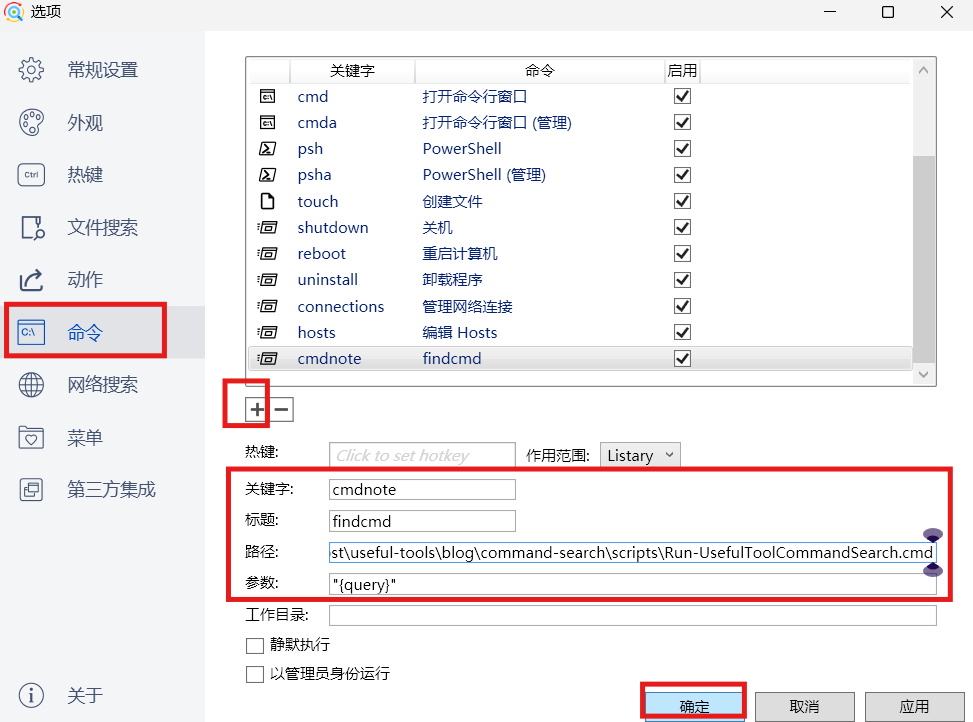
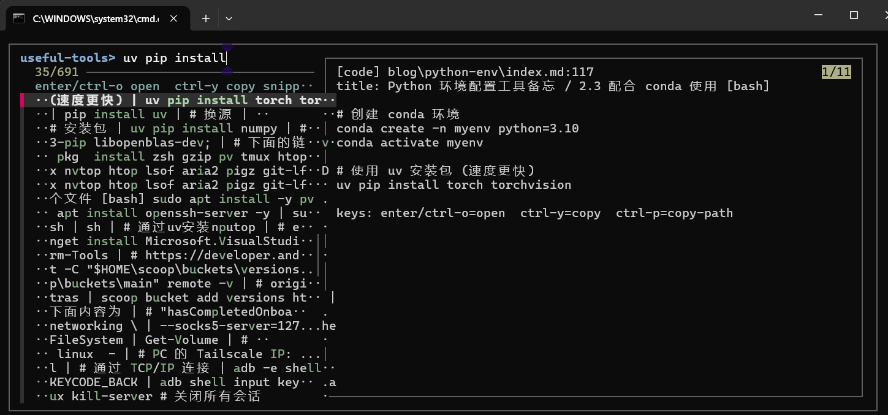
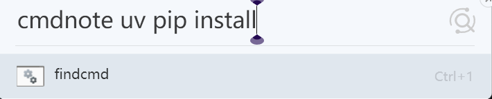
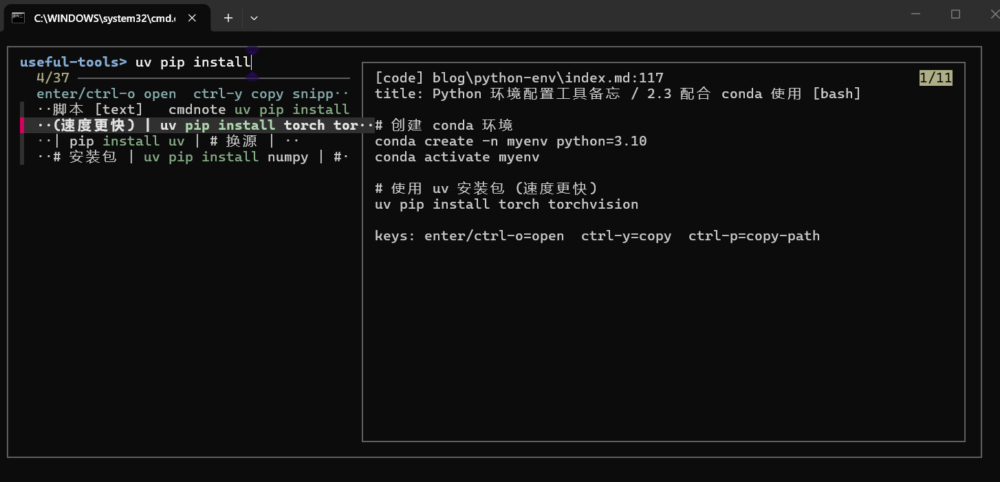

# Windows 本地命令库快速检索

需要使用的命令太多难以记全，而本地的大部分命令备忘录都写在同一个目录的不同文件内容，每次找命令打开 VS Code 再全局搜索，步骤太长。更合适的方式是：

`Listary -> 启动脚本 -> rg 缩小文件范围 -> fzf 预览 -> 一键复制命令或打开原文`

## 1. 依赖

```powershell
scoop install fzf ripgrep
```

## 2. 脚本位置

脚本包含两个文件：

- [`Find-UsefulToolCommand.ps1`](https://github.com/huluhuluu/useful-tools/blob/main/blog/command-search/scripts/Find-UsefulToolCommand.ps1)
- [`Run-UsefulToolCommandSearch.cmd`](https://github.com/huluhuluu/useful-tools/blob/main/blog/command-search/scripts/Run-UsefulToolCommandSearch.cmd)
- [`UsefulToolCommandSearch.root.txt.example`](https://github.com/huluhuluu/useful-tools/blob/main/blog/command-search/scripts/UsefulToolCommandSearch.root.txt.example)

其中：

- `.ps1` 是真正干活的主脚本
- `.cmd` 是给 Listary 调起用的启动器，只负责把参数原样转给 `.ps1`
- `.root.txt.example` 是默认搜索目录的示例配置

调用关系是：

`Listary -> Run-UsefulToolCommandSearch.cmd -> Find-UsefulToolCommand.ps1 -> rg + fzf`

主脚本会：

1. 遍历目标目录下的 Markdown
2. 提取 fenced code block，并用标题作为结果上下文
3. 如果传入初始查询词，先用 `rg` 缩小候选文件范围
4. 把候选片段送进 `fzf`
5. 在右侧预览里展示代码块和原文上下文
6. 根据按键执行复制、打开、复制路径

### 2.1 默认查询目录

脚本现在支持三种方式指定搜索根目录，优先级从高到低是：

1. 启动时显式传 `-Root`
2. 环境变量 `USEFUL_TOOL_SEARCH_ROOT`
3. `scripts/UsefulToolCommandSearch.root.txt`
4. 如果都没有，就回退到脚本默认值，也就是 `content/post/useful-tools`

最省事的方式是直接在 `scripts` 目录下新建：

```text
UsefulToolCommandSearch.root.txt
```

文件内容只写一行目录路径，例如：

```text
C:\Users\xxx\work\blog\HugoBlog\content\post\useful-tools\blog
```

或者写相对路径：

```text
..\..\..
```
### 2.2 主脚本使用方式

直接运行:

```powershell
pwsh -NoProfile -ExecutionPolicy Bypass -File .\Find-UsefulToolCommand.ps1
```

或者给一个初始查询词：

```powershell
pwsh -NoProfile -ExecutionPolicy Bypass -File .\Find-UsefulToolCommand.ps1 docker
pwsh -NoProfile -ExecutionPolicy Bypass -File .\Find-UsefulToolCommand.ps1 adb wireless
```

如果想临时指定搜索目录：

```powershell
pwsh -NoProfile -ExecutionPolicy Bypass -File .\Find-UsefulToolCommand.ps1 -Root 'C:\my-notes' docker
```

### 2.3 调用 `.cmd` 启动器

也可以调用 launcher：

```powershell
.\Run-UsefulToolCommandSearch.cmd git rebase
```

这里的参数会被 `.cmd` 原样转给 `.ps1`，所以：

- `Run-UsefulToolCommandSearch.cmd` 只负责启动 PowerShell
- `Find-UsefulToolCommand.ps1 git rebase` 才是真正执行搜索

### 2.4 `fzf` 内快捷键

- `Enter`：打开文件，默认优先用 VS Code 并跳到对应行
- `Ctrl+O`：同样打开文件
- `Ctrl+Y` / `Alt+Y`：复制左侧当前高亮代码块的 `snippet` 到剪贴板，复制后自动回到 `fzf`
- `Ctrl+P` / `Alt+P`：复制当前文件路径，复制后自动回到 `fzf`
- `Ctrl+/`：切换预览窗口

右侧预览分成两部分：

- `snippet`：`Ctrl+Y` / `Alt+Y` 实际会复制的内容
- `context`：命令所在 Markdown 原文的上下文，用来判断这条命令是不是当前场景

`fzf` 的右侧预览区不是文本编辑器，不能稳定地用鼠标选择其中一部分来复制。这里的复制粒度固定是左侧当前高亮的一个代码块；如果只想截取其中一行，按 `Enter` 或 `Ctrl+O` 打开原文后再复制。

## 3. Listary
`Listary` 在这个流程中只负责全局唤起。

### 3.1 设置命令

1. 右下角托盘右键 `Listary`，打开 `Listary -> 选项 -> 命令`
2. 新增一个自定义命令，`Alias` 填一个自己顺手的别名，`Path` 或 `Program` 指向脚本绝对路径，参数默认填 `{query}`

3. 保存

这样以后在 Listary 里输入：

```text
# 这里需要多输一个空格 不然解析不出来
cmdnote 
```

就会直接拉起 `fzf` 让你做全量筛选，如图：


这里不要依赖鼠标框选终端内容来复制。Listary 拉起的是一个临时终端窗口，窗口本身可以正常显示 `fzf`，但预览区里的文字不能当作普通文本选择。复制动作交给脚本快捷键处理：

- `Ctrl+Y` / `Alt+Y`：复制当前 `snippet`
- `Ctrl+P` / `Alt+P`：复制当前文件路径

复制后会重新回到 `fzf`，并在顶部显示刚才复制的条目。如果当前终端环境里 `Ctrl+Y` 被拦截，就用 `Alt+Y`。

### 3.2 传 `Listary` 关键字给脚本

上面设置的参数 `{query}` 会被 `Listary` 替换成你输入的内容，也就是初始查询词，所以你可以在 `Listary` 里直接输入：

```text
cmdnote uv pip install
```



这会把 `Listary` 输入的内容作为初始查询词传给脚本：



### 3.3 Listary 内快捷键
- `启动搜索面板`：连按两次 `Ctrl`
- `Web 搜索`：`g/bing` + `空格` + `查询词`，分别是谷歌 / 必应搜索

## 参考链接

- [fzf GitHub](https://github.com/junegunn/fzf)
- [ripgrep GitHub](https://github.com/BurntSushi/ripgrep)
- [Listary](https://www.listary.com/)
