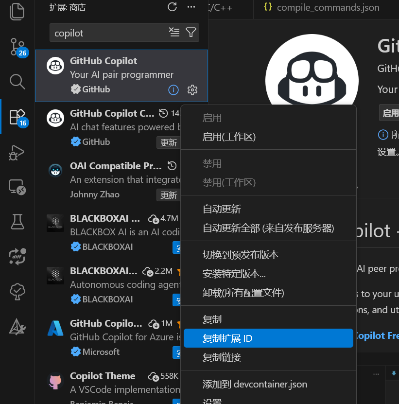
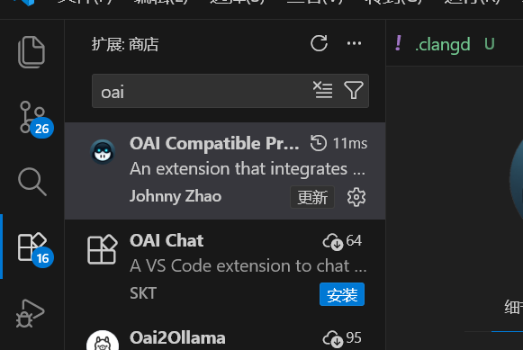
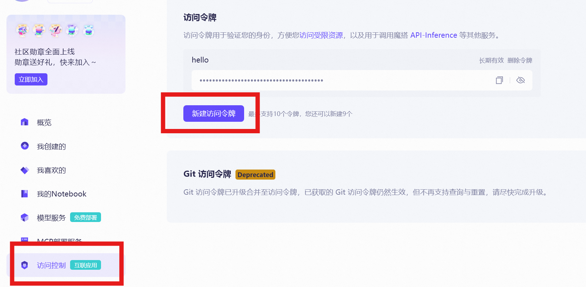
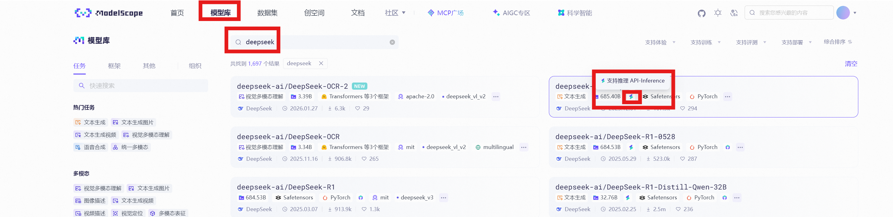
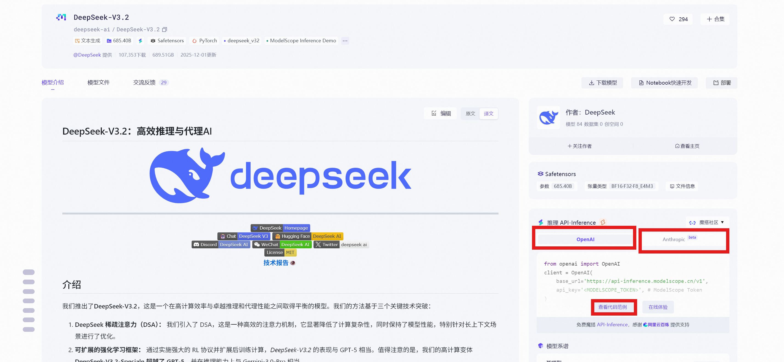
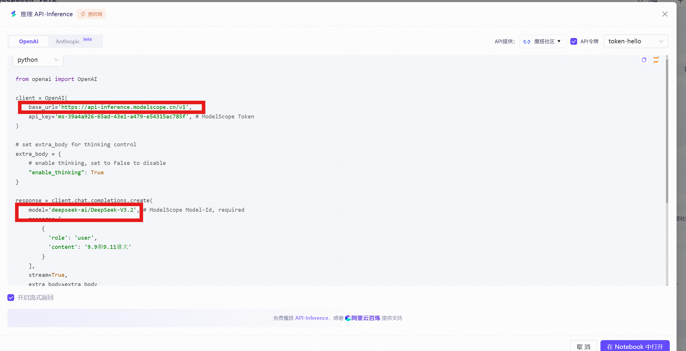
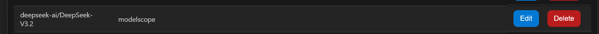
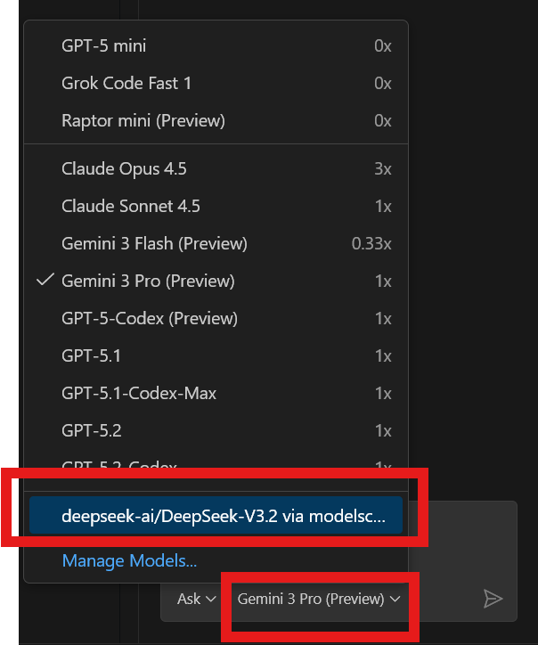

# VSCode Copilot 配置指南

`copilot chat` 在本地运行可以用本地局域网的一些大模型推理 API 接口。通过设置 UI 模式决定让对应插件运行在服务器/本地。

**注意：按需配置**

## 1. 配置 UI 模式

- `ctrl+shift+p` 打开命令面板搜索并且选中 `Preferences: Open User Settings (JSON)`。这将打开本地的 VSCode 设置文件 `settings.json`。

- 在本地 settings.json 文件中添加 extensionKind 参数 ([参数文档](https://code.visualstudio.com/api/advanced-topics/extension-host))，添加需要本地运行的插件。

```json
"remote.extensionKind": {
	"johnny-zhao.oai-compatible-copilot" : [ // 给copilot-chat配置自定义api接口的插件
		"ui"
	],
	"github.copilot" : [ // copilot
		"ui"
	],
	"github.copilot-chat": [ // copilot chat
		"ui"
	]
}
```

这里插件 ID 可以在插件商店选中插件右键复制



## 2. 配置第三方 API

`copilot chat` 可以通过插件与其它自行购买**第三方**的 API 兼容。例如，在 VSCode 安装 `OAI Compatible Provider for Copilot` 插件，[仓库链接](https://github.com/JohnnyZ93/oai-compatible-copilot)，可以直接在 VSCode 的插件商店下载。



### 2.1 获取 API 信息

下面以 ModelScope 社区的 API 接口为例：

- 在 ModelScope 社区的 **个人主页->访问控制** 里新建一个访问令牌



- 随后在模型库搜索需要的模型，支持推理 API 的就是可以使用 API 调用的模型



- 点击这个模型，进入这个模型的描述页面，右侧有 API 调用的接口，存在不同格式，按需选择。



- 查看代码范例，中有该模型接口的 base_url 和模型 ID 信息



### 2.2 配置插件信息

`ctrl+shift+p` 命令行搜索打开 `OAICopilot: Open Configuration UI`

**添加供应方 (Provider)**：需要填写 baseurl (上面出现的 base_url) 和 token (前面新建的访问令牌)，以及对应的 API 接口格式，例如 OpenAI 格式 (这里是查看代码范例时选择的格式)


**添加模型**：需要填写前面添加的 provider (可以自定义) 和模型 ID (上面出现的模型 ID)




目前插件支持 openai, openai-responses, ollama, anthropic, gemini 等多种格式，具体细节见[插件仓库](https://github.com/JohnnyZ93/oai-compatible-copilot)。

每个模型可以定义采样的 temperature、top_p、top_k 等参数，细节同见[仓库](https://github.com/JohnnyZ93/oai-compatible-copilot)。

### 2.3 使用模型

在 Copilot Chat 界面选择对应模型就可以使用对应模型的 Copilot Chat 了


