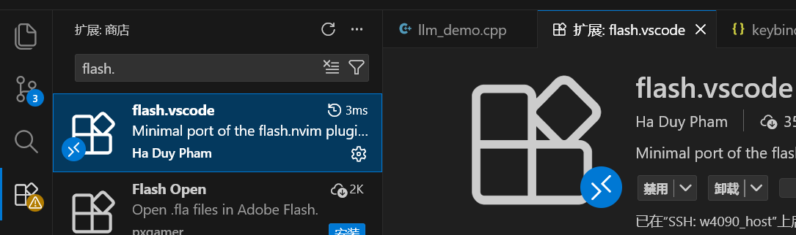
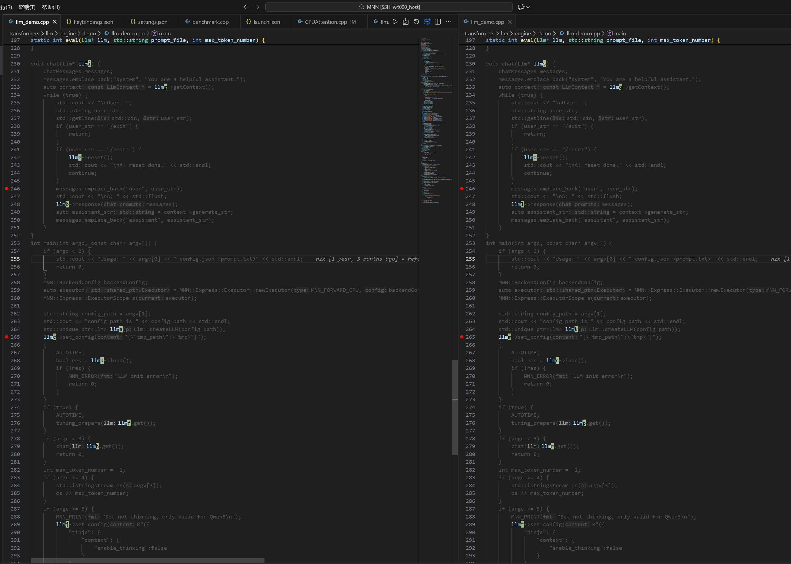
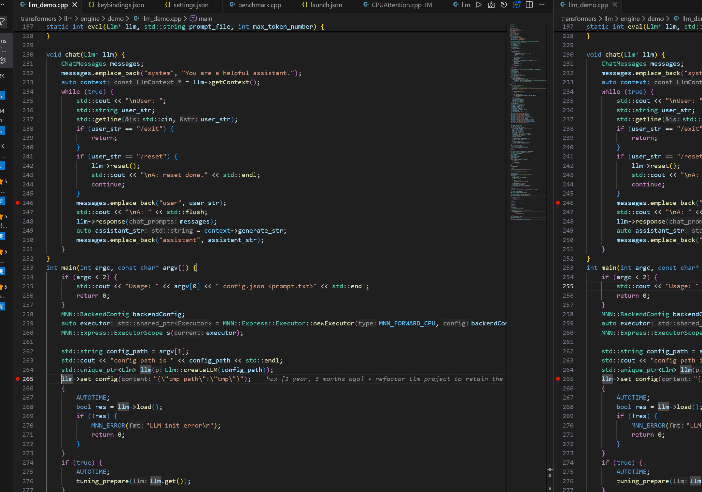

# flash.vscode 插件

使用 [flash.vscode](https://github.com/dautroc/flash-vscode) 插件可以在 VSCode 中跳转到屏幕可见的任意一行。

## 1. 安装插件

直接在 VSCode 插件商店下载 `flash.vscode` 插件



## 2. 使用方法

`ctrl+shift+p` 面板搜索选择 `flash-vscode: Start Navigation`，然后键入光标想去的位置的单词，例如下面我输入的是 llm



屏幕中所有可见的 llm 都被索引到并且后方出现一个字母标签，按下对应的字母标签光标就可以跳转到对应位置，例如按下位置 c，光标出现在左边分屏的第 265 行



## 3. 绑定快捷键

现在的启动方式还是太抽象了，`ctrl+shift+p` 面板搜索选择 `Preferences: Open Keyboard Shortcuts (JSON)`，添加快捷键绑定，现在可以通过 "ctrl" 和 ";" 启动搜索。

**注意这个启动命令可能随着插件版本升级更换，具体命令见 [GitHub 仓库](https://github.com/dautroc/flash-vscode)**。

```json
{
    "key": "ctrl+;",
    "command": "flash-vscode.start" // 可能更换
}
```

## 4. 取消搜索

取消这次搜索按 ESC 键
