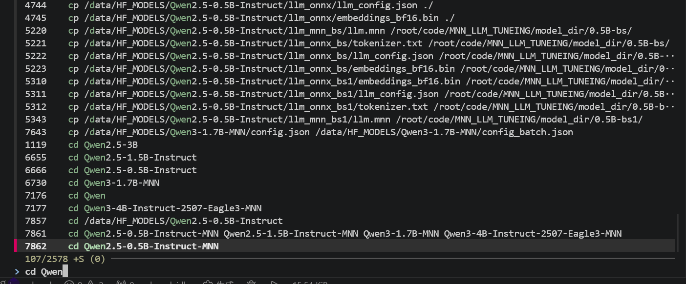
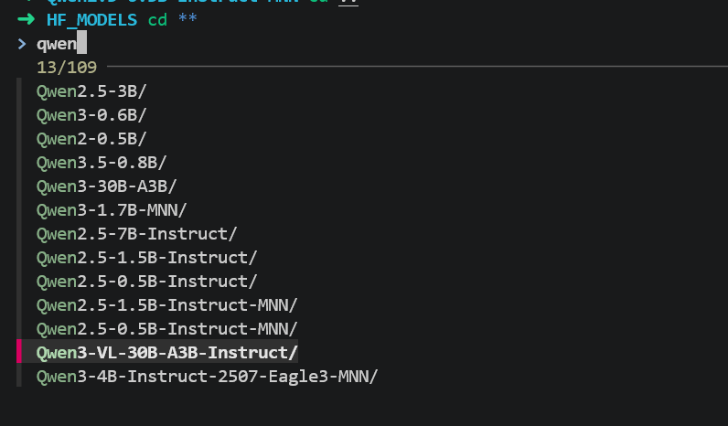

# FZF 使用备忘

[FZF](https://github.com/junegunn/fzf) 是一个通用的命令行模糊搜索工具，可以与多种工具配合使用，例如CRTL+R搜索历史命令、快速打开文件等。用 Go 编写，速度非常快，[tutorial与效果演示参考](https://yalandhong.github.io/2022/11/03/shell/zsh-fzf)。

## 1. 安装

```bash
# 克隆仓库
git clone --depth 1 https://github.com/junegunn/fzf.git ~/.fzf
# 运行安装脚本
~/.fzf/install
```

### 1.1 配置zsh

```bash
# 在 ~/.zshrc 的插件中中添加 fzf，例如下面， 这里的插件使用空格分隔
plugins=(git sudo z zsh-syntax-highlighting zsh-autosuggestions fzf)

# 过程
vim ~/.zshrc
/plugins= # 命令模式直接输入前面字符串 然后回车 表示搜索这个命令
# 在末尾添加 fzf
# 保存退出 (:wq)
source ~/.zshrc # 使配置生效
``` 

## 2. 基本使用

### 2.1 文件搜索

```bash
# 搜索当前目录文件
fzf

# 搜索并打开文件
vim $(fzf)
```

### 2.2 历史命令搜索

按 Ctrl-R 搜索历史命令，输入关键字实时过滤


### 2.3 模糊搜索
在`shell`中，输入`**`再按tab可以进入`fzf`的模糊搜索模式，输入关键字后按回车即可跳转到对应目录。


### 2.4 子目录直达
`Alt+C` 可以进入`fzf`的子目录搜索模式，输入关键字后按回车即可跳转到对应目录。

## 3. 高级用法

### 3.1 搜索语法

在 fzf 搜索框中可以使用特殊语法：

```
abc          # 包含 abc
^abc         # 以 abc 开头
abc$         # 以 abc 结尾
!abc         # 不包含 abc
abc def      # 同时包含 abc 和 def
abc|def      # 包含 abc 或 def
'abc         # 精确匹配 abc（非模糊）
!^abc        # 不以 abc 开头
```

### 3.2 多选模式

```bash
# 多选文件（Tab 选择，Shift-Tab 取消）
fzf --multi
```

## 4. Windows Pwsh 配置

如果 `fzf` 是通过 `scoop install fzf` 安装的，一般已经在 `PATH` 中，可以先验证：

```powershell
Get-Command fzf.exe
```

PowerShell 中的快捷键绑定不是 `fzf` 自带的，可以搭配 [PSFzf](https://github.com/kelleyma49/PSFzf) 模块绑定：`PSFzf` 负责把 `fzf` 接到 `PSReadLine` 上，这样就能在 `pwsh` 里使用 `Ctrl+R`、`Ctrl+T`、`Alt+C` 这些快捷键。

### 4.1 安装fzf

```powershell
scoop install fzf
```

### 4.2 安装 PSFzf

常规安装方式:

```powershell
Install-Module PSFzf -Scope CurrentUser
```

如果 PowerShell Gallery 因为证书链问题无法安装，也可以手动把模块解压到用户模块目录：

```powershell
$pkg = Join-Path $env:TEMP 'psfzf.2.7.10.nupkg'
curl.exe -L -k 'https://cdn.powershellgallery.com/packages/psfzf.2.7.10.nupkg' -o $pkg

$moduleDir = "$HOME\\Documents\\PowerShell\\Modules\\PSFzf\\2.7.10"
New-Item -ItemType Directory -Force -Path $moduleDir
Add-Type -AssemblyName System.IO.Compression.FileSystem
[IO.Compression.ZipFile]::ExtractToDirectory($pkg, $moduleDir)
```

### 4.2 写入 PowerShell Profile

PowerShell 7 的 profile 路径一般是：

```powershell
# 可以通过 $PROFILE 变量查看当前 profile 路径
$PROFILE
# 例如：
C:\Users\xxx\Documents\PowerShell\Microsoft.PowerShell_profile.ps1
```

向 profile 中加入下面配置，不需要每次启动pwsh都手动执行：

```powershell
Import-Module PSReadLine -ErrorAction SilentlyContinue

if (Get-Command fzf.exe -ErrorAction SilentlyContinue) {
    Import-Module PSFzf -ErrorAction SilentlyContinue

    if (Get-Command Set-PsFzfOption -ErrorAction SilentlyContinue) {
        Set-PsFzfOption `
            -PSReadlineChordProvider 'Ctrl+t' `
            -PSReadlineChordReverseHistory 'Ctrl+r' `
            -PSReadlineChordSetLocation 'Alt+c' `
            -TabExpansion
    }
}
```

配置写完后重新加载：

```powershell
. $PROFILE
```

### 4.3 快捷键说明

- `Ctrl+T`：在当前目录或当前输入路径下启动 `fzf`，选择文件或路径并插入到命令行
- `Ctrl+R`：模糊搜索 PowerShell 历史命令，选中后回填到当前命令行
- `Alt+C`：模糊搜索子目录并直接切换到该目录
- `Tab`：启用 `fzf` 风格补全；输入路径片段或 `**` 后按 `Tab` 可以进入选择界面

### 4.4 使用示例

```powershell
# 先输入一部分路径，再按 Ctrl+T 补全
code .\cont

# 按 Ctrl+R 搜索历史命令
git

# 按 Alt+C 模糊切换目录
cd
```

### 4.5 检查是否生效

```powershell
Get-Module PSFzf
Get-PSReadLineKeyHandler | Where-Object {
    $_.Key -in 'Ctrl+t', 'Ctrl+r', 'Alt+c', 'Tab'
}
```
---

## 参考链接

- [FZF GitHub](https://github.com/junegunn/fzf)
- [FZF Wiki](https://github.com/junegunn/fzf/wiki)
- [FZF效果](https://yalandhong.github.io/2022/11/03/shell/zsh-fzf)
