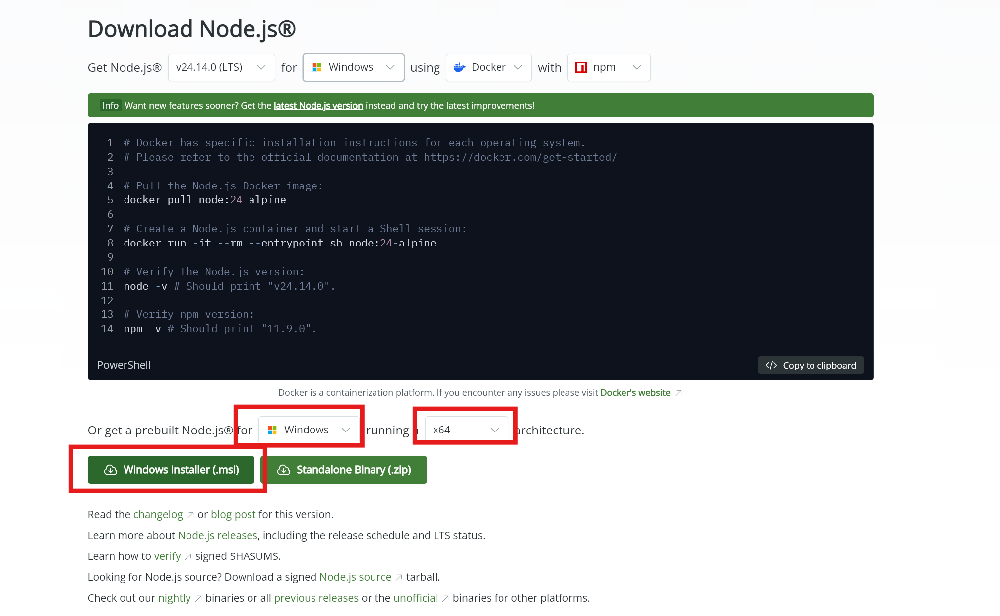
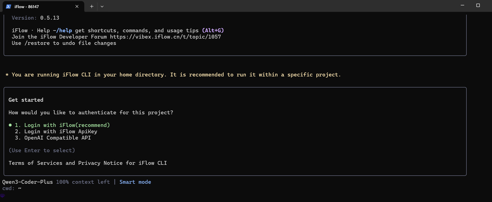
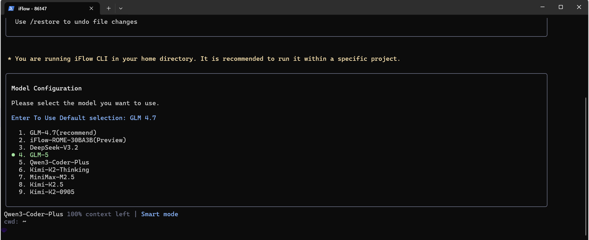

# iFlow CLI 配置指南

[iFlow](https://platform.iflow.cn/) 是阿里推出的一个在终端中运行的 Agent 框架，可以接入多种大模型 API，目前提供限免的 GLM5.0、Kimi-K2.5、MiniMax-M2.5 等模型。

下面以 Windows 为例，配置记录如下：

## 1. 安装 NodeJS

安装 [NodeJS](https://nodejs.org/en/download)，选择对应系统与指令集的预编译安装包，下载后双击，同意协议并安装。



## 2. 安装 iFlow

打开 `PowerShell` 安装 `iFlow`:

```powershell
# 访问 https://nodejs.org/zh-cn/download 下载最新的 Node.js 安装程序
npm install -g @iflow-ai/iflow-cli@latest
iflow --version # 有输出验证安装成功
```

`linux`安装
```bash
# 1. 直接安装
bash -c "$(curl -fsSL https://gitee.com/iflow-ai/iflow-cli/raw/main/install.sh)"

# 2. 通过 npm 安装 依赖nodejs
npm i -g @iflow-ai/iflow-cli@latest
iflow --version # 有输出验证安装成功

# 如果索引不到iflow命令，可以尝试以下命令
# 激活nvm
echo '
export NVM_DIR="$HOME/.nvm"
[ -s "$NVM_DIR/nvm.sh" ] && \. "$NVM_DIR/nvm.sh"' >> ~/.zshrc
export NVM_DIR="$HOME/.nvm"
[ -s "$NVM_DIR/nvm.sh" ] && \. "$NVM_DIR/nvm.sh"
[ -s "$NVM_DIR/bash_completion" ] && \. "$NVM_DIR/bash_completion"
nvm --version # 验证nvm
export NVM_NODEJS_ORG_MIRROR=https://npmmirror.com/mirrors/node # 设置镜像源
# 如果nodejs版本过低，可以使用nvm安装最新版本的nodejs
nvm install 20 # 安装nodejs 20版本
```
## 3. 登录配置

打开 shell，启动 iFlow 后进入登录界面：

```powershell
iflow
```

共有三个登录方式：

1. **打开网页授权**
2. **使用 API Key**：需要在[心流 API 平台](https://platform.iflow.cn/profile?tab=apiKey)设置，这个 Key 每周会刷新，过期后可以通过 `/auth` 命令刷新
3. **使用 OpenAI 兼容的第三方 API**



配置好 Key 后，可以选择使用的模型：



## 4. 常用命令

| 命令 | 说明 |
|------|------|
| `/resume` | 恢复之前的对话，继续之前的上下文 |
| `/clear` | 清除之前的对话上下文，重新开始 |
| `/compress` | 压缩之前的对话上下文，保留关键信息，释放上下文空间 |
| `/init` | 初始化一个新的对话，会在目录下生成 AGENTS.md 文件，记录初始化信息 |

