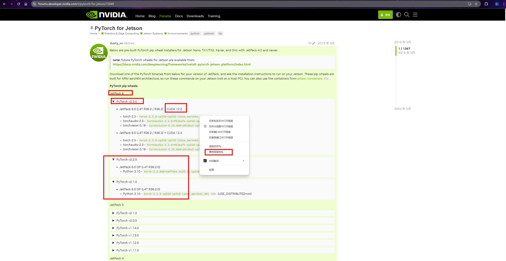
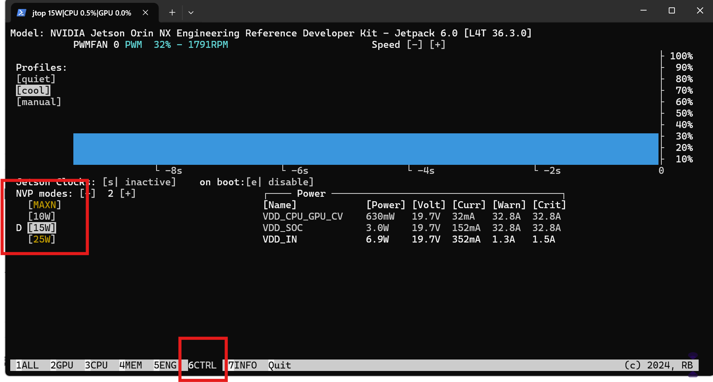

# Jetson 环境配置备忘

NVIDIA Jetson 系列 (Nano/Xavier NX/Orin) 边缘计算开发板环境配置记录。

## 1. 新用户
创建新用户并且复制ssh公钥，同时添加到jtop分组中
```bash
sudo adduser huluhuluu
sudo usermod -aG jtop huluhuluu
sudo usermod -aG sudo huluhuluu # 添加sudo权限 慎重
sudo su huluhuluu
cd /home/huluhuluu
mkdir .ssh && cd .ssh
touch authorized_keys
vim authorized_keys
```

## 2. 安装常用包
```bash
# 安装常用工具
sudo apt-get install zsh gzip netcat pv tmux nvtop htop lsof aria2 pigz git-lfs -y

# 配置 zsh
git clone https://gitee.com/mirror-hub/ohmyzsh.git ~/.oh-my-zsh
# 插件
cp ~/.oh-my-zsh/templates/zshrc.zsh-template ~/.zshrc
git clone https://gitee.com/mirror-hub/zsh-syntax-highlighting.git ~/.oh-my-zsh/custom/plugins/zsh-syntax-highlighting
git clone https://gitee.com/mirror-hub/zsh-autosuggestions.git ~/.oh-my-zsh/custom/plugins/zsh-autosuggestions
# 启用插件
echo "autoload -U compinit && compinit" >> ~/.zshrc
sed -i '/^plugins=/c\plugins=(git sudo z zsh-syntax-highlighting zsh-autosuggestions)' ~/.zshrc
# 自动切换zsh
touch ~/.bash_profile
changeshell="exec $(which zsh) -l"
echo "$changeshell" >> ~/.bash_profile
```

### 2.1 安装minifoge
```bash
# 下载aarch版安装脚本
wget https://mirror.nju.edu.cn/github-release/conda-forge/miniforge/LatestRelease/Miniforge3-Linux-aarch64.sh
# 安装和删除
bash Miniforge3-Linux-aarch64.sh
rm -rf Miniforge3-Linux-aarch64.sh
# 设置环境变量
echo 'source ~/miniforge3/etc/profile.d/conda.sh'  |  tee -a ~/.zshrc # 这里的路径注意要匹配

# 可执行权限
chmod u+x ~/miniforge3/etc/profile.d/conda.sh

# ！！重要， 配置CUDA的环境变量
vim ~/.zshrc
export PATH="/usr/local/cuda/bin:$PATH"
export LD_LIBRARY_PATH="/usr/local/cuda/lib64:$LD_LIBRARY_PATH"
source ~/.zshrc

# 初始化并且配置清华源
conda init
conda config --add channels https://mirrors.tuna.tsinghua.edu.cn/anaconda/pkgs/free/
conda config --add channels https://mirrors.tuna.tsinghua.edu.cn/anaconda/pkgs/main/
conda config --add channels https://mirrors.tuna.tsinghua.edu.cn/anaconda/cloud/conda-forge/
conda config --add channels https://mirrors.tuna.tsinghua.edu.cn/anaconda/cloud/bioconda/
```

### 2.2 pytorch安装
需要特定版本的pytorch，参考[版本兼容表](https://forums.developer.nvidia.com/t/pytorch-for-jetson/72048)和[官方安装教程](https://docs.nvidia.com/deeplearning/frameworks/install-pytorch-jetson-platform/index.html#)

- 先查看jetpack版本和cuda版本
```bash
(base) ➜  ~ sudo apt-cache show nvidia-jetpack  # 查看jetpack版本命令
Package: nvidia-jetpack
Source: nvidia-jetpack (6.0) # jetpack版本
Version: 6.0+b106
Architecture: arm64
Maintainer: NVIDIA Corporation
Installed-Size: 194
Depends: nvidia-jetpack-runtime (= 6.0+b106), nvidia-jetpack-dev (= 6.0+b106)
Homepage: http://developer.nvidia.com/jetson
Priority: standard
Section: metapackages
Filename: pool/main/n/nvidia-jetpack/nvidia-jetpack_6.0+b106_arm64.deb
Size: 29296
SHA256: 561d38f76683ff865e57b2af41e303be7e590926251890550d2652bdc51401f8
SHA1: ef3fca0c1b5c780b2bad1bafae6437753bd0a93f
MD5sum: 95de21b4fce939dee11c6df1f2db0fa5
Description: NVIDIA Jetpack Meta Package
Description-md5: ad1462289bdbc54909ae109d1d32c0a8

Package: nvidia-jetpack
Source: nvidia-jetpack (6.0)
Version: 6.0+b87
Architecture: arm64
Maintainer: NVIDIA Corporation
Installed-Size: 194
Depends: nvidia-jetpack-runtime (= 6.0+b87), nvidia-jetpack-dev (= 6.0+b87)
Homepage: http://developer.nvidia.com/jetson
Priority: standard
Section: metapackages
Filename: pool/main/n/nvidia-jetpack/nvidia-jetpack_6.0+b87_arm64.deb
Size: 29298
SHA256: 70be95162aad864ee0b0cd24ac8e4fa4f131aa97b32ffa2de551f1f8f56bc14e
SHA1: 36926a991855b9feeb12072694005c3e7e7b3836
MD5sum: 050cb1fd604a16200d26841f8a59a038
Description: NVIDIA Jetpack Meta Package
Description-md5: ad1462289bdbc54909ae109d1d32c0a8

N: Ignoring file 'cuda-tegra-ubuntu2204-12-2-local.list.backup' in directory '/etc/apt/sources.list.d/' as it has an invalid filename extension

(base) ➜  ~ nvcc --version  # 查看cuda版本命令
nvcc: NVIDIA (R) Cuda compiler driver
Copyright (c) 2005-2023 NVIDIA Corporation
Built on Tue_Aug_15_22:08:11_PDT_2023
Cuda compilation tools, release 12.2, V12.2.140
Build cuda_12.2.r12.2/compiler.33191640_0 # cuda 版本
```

- 根据`jetpack`版本和`cuda`版本查找对应的`pytorch`版本与下载链接,以`nvidia-jetpack (6.0)和cuda12.2`为例，在[版本兼容表](https://forums.developer.nvidia.com/t/pytorch-for-jetson/72048)中找到对应的`pytorch`版本, 右键复制下载链接
    

- 指定`pyhton`版本创建虚拟环境，安装对应`pytorch`
```bash
# 创建/启动虚拟环境 需要制定python版本！！
sudo apt-get -y update; 
sudo apt-get install -y  python3-pip libopenblas-dev;

# 下面的链接换成上一步复制的链接
export TORCH_INSTALL=https://developer.download.nvidia.cn/compute/redist/jp/v512/pytorch/torch-2.1.0a0+41361538.nv23.06-cp38-cp38-linux_aarch64.whl
python3 -m pip install --upgrade pip; 
python3 -m pip install --no-cache $TORCH_INSTALL
```

- 验证，`python`交互模式中输入，能够正常输出gpu数量/gpu型号安装成功
```bash
import torch
print(torch.__version__)
torch.cuda.device_count()
torch.cuda.get_device_name(0)
```
- **注意**：后续缺失的包尽量用**pip**安装

## 2.3. 常用命令

```bash
# 性能监控
sudo jtop
htop # CPU监控

# 电源调优
sudo nvpmodel -q --verbose # 查看当前模式和频率
sudo nvpmodel -q   # 查看当前模式
sudo nvpmodel -m 0 # 设置最大性能模式 (15W/30W 取决于设备)
sudo nvpmodel -m 1 # 设置省电模式

# 频率调优
sudo jetson_clocks # 启用最高性能
sudo jetson_clocks --restore # 恢复默认频率
sudo jetson_clocks --show # 查看当前状态
```
可以在jtop中查看当前模式和频率,启动 jtop 后按 → 切换到 CTRL 页面可以看到左下角的`NV Power Mode`， 同时可以看到`jetpack`版本，在`7INFO`界面可以看到`cuda`版本等信息


---

## 3. 参考链接

- [NVIDIA JetPack](https://developer.nvidia.com/embedded/jetpack)
- [Jetson 开发者论坛](https://forums.developer.nvidia.com/)
- [jetson-stats](https://github.com/rbonghi/jetson_stats)
