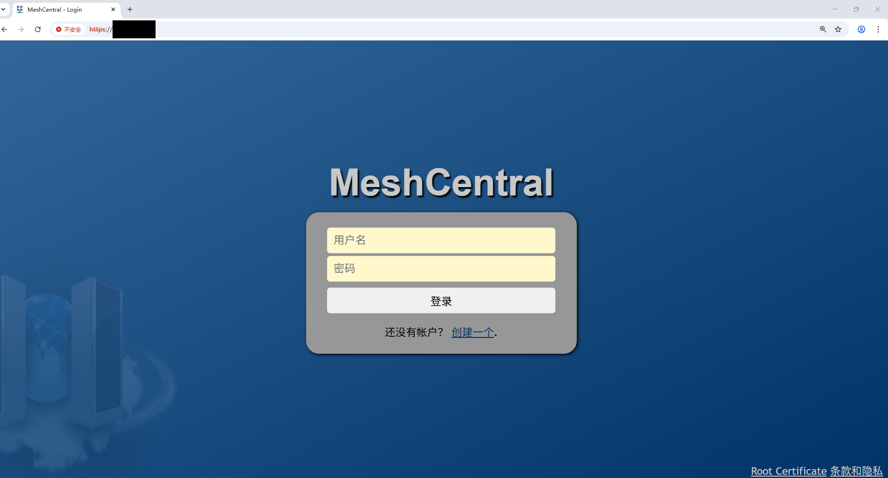
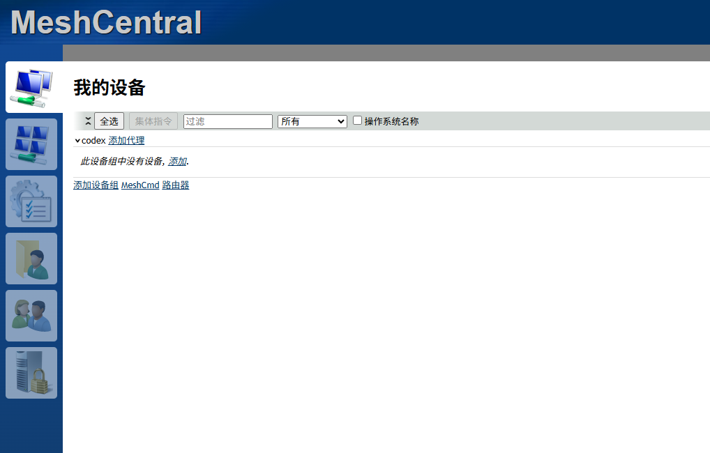
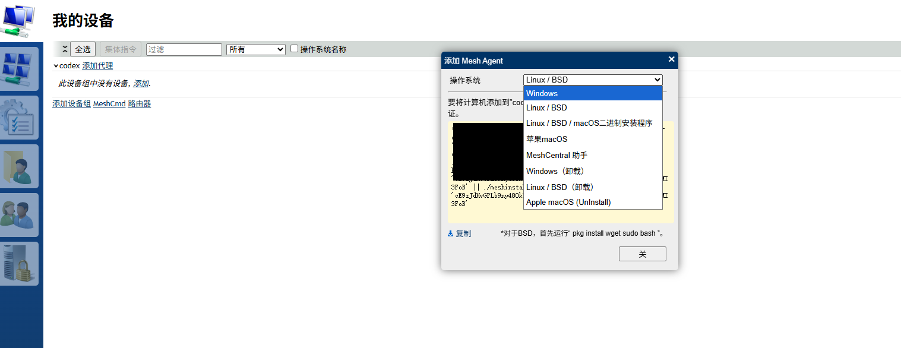
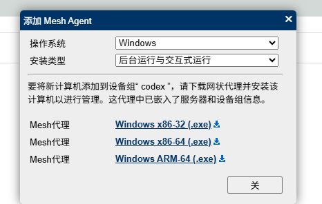

# MeshCentral 使用备忘

如果只是想在手机上接管一个终端，`tmux + ttyd + Tailscale` 已经够用了。  
但如果想把多台机器统一纳管，顺手拿到终端、文件、桌面和设备信息，`MeshCentral` 更合适。

这次的使用结构是：

- `Ubuntu Server`：跑 `MeshCentral Server`
- `Ubuntu 机器1`：安装 `Mesh Agent`
- `Windows 机器`：安装 `Mesh Agent`
- `Android`：直接用浏览器访问 `MeshCentral Web`

## 1. 整体思路

可以把它理解成一个中心控制台：

```text
Android 浏览器
       |
       v
Ubuntu Server (MeshCentral Server)
      / \
     /   \
    v     v
Ubuntu 机器1   Windows 机器
   Mesh Agent   Mesh Agent
```

核心点：

1. `MeshCentral Server` 提供 Web 控制台和中继能力
2. 被控机器只需要主动安装并连接 `Mesh Agent`
3. `Android` 端不需要装 agent，直接浏览器登录即可

## 2. MeshCentral Server安装

### 2.1 安装 Node.js 和 npm

`MeshCentral` 基于 `Node.js` 运行，先准备运行时：

```bash
sudo apt update
sudo apt install -y nodejs npm

node -v  # v22.22.0 输出版本号表示安装成功
npm -v # 10.9.4 输出版本号表示安装成功
```

### 2.2 允许 Node 监听低端口

`MeshCentral` 默认会用到 `80`、`443` 和 `4433` 端口。  
在 Linux 上，普通用户默认不能直接监听 `1024` 以下端口，所以先给 `node` 这个能力：

```bash
whereis node
sudo setcap cap_net_bind_service=+ep /usr/bin/node
```

上面的 `/usr/bin/node` 需要和你本机实际 `node` 路径一致。

### 2.3 安装并启动

```bash
mkdir -p ~/meshcentral
cd ~/meshcentral

npm install meshcentral
node node_modules/meshcentral # 启动demo验证

# 正式启动 指定端口
node node_modules/meshcentral --port 8009
```

第一次启动后，会在当前目录生成 `meshcentral-data`，配置文件也会放在这里。

### 2.4 首次登录

启动后，在浏览器访问：

```text
https://服务器IP/
https://服务器域名/
```


第一次创建的账号会自动成为管理员账号.

默认情况下，`MeshCentral` 以 `LAN-only` 模式启动，适合同一局域网内先测试流程。

## 3. Ubuntu 安装 Mesh Agent

登录 `MeshCentral Web`，让服务端直接生成对应平台的安装脚本。



大致流程：

1. 登录 Web 控制台
2. 新建一个设备组，或者进入现有设备组
3. 在组内选择添加设备 / 安装 agent
4. 选择对应平台，例如 `Linux x86-64`
5. 复制服务端生成的安装命令，到目标 Ubuntu 机器执行

这样：

- agent 会自动带上当前服务端地址
- 会自动归到你选中的设备组
- 少手动拼参数，不容易把连接地址写错

安装完后，目标 Ubuntu 机器会自动回连到服务端，并出现在设备列表里。




```bash
# 下面的ip必须修改为可达ip
(wget "https://127.0.0.1:8009/meshagents?script=1" --no-check-certificate -O ./meshinstall.sh || wget "https://127.0.0.1:8009/meshagents?script=1" --no-proxy --no-check-certificate -O ./meshinstall.sh) && chmod 755 ./meshinstall.sh && sudo -E ./meshinstall.sh https://127.0.0.1:8009 'cE9zJdHvGPLb9ny480kIVzV9EWJmqsZfMWpanPI2QyRu0eutcP5xtRh4J5MI3FoB' || ./meshinstall.sh https://127.0.0.1:8009 'cE9zJdHvGPLb9ny480kIVzV9EWJmqsZfMWpanPI2QyRu0eutcP5xtRh4J5MI3FoB'
```

## 4. Windows 机器安装 Mesh Agent

Windows 端同样建议从 `MeshCentral Web` 里直接下载当前组对应的安装包。

流程基本一样：

1. 登录 Web 控制台
2. 进入目标设备组
3. 选择 Windows 平台 agent
4. 下载生成好的 `exe`
5. 在目标 Windows 机器上运行安装

安装完成后，`Windows` 机器会自动上线。  
按照官方文档，默认安装路径通常在：

```text
c:\Program Files\Mesh Agent
```

如果要手动控制服务，可参考：

```powershell
net start "mesh agent"
net stop "mesh agent"
```



- **BUGS:** 当前`MeshCentral v1.1.54`版本的winodows安装有问题
  - [页面刚刷新时才能下载](https://github.com/Ylianst/MeshCentral/issues/7771)
  - 下载后双击exe无法安装，出现[找不到指定程序](https://github.com/Ylianst/MeshCentral/issues/7606)，需要管理员模式启动pwsh，执行：` .\meshagent64-codex.exe --fullinstall` 参数安装

## 5. Android 浏览器访问

这部分是整个方案里最直接的地方：`Android` 不装 agent，只需要浏览器。

在手机浏览器打开：

```text
https://服务器IP/
```

或者：

```text
https://服务器域名/
```

登录后就可以看到已经接入的 `Ubuntu` 和 `Windows` 设备。

在手机上更实用的几个入口通常是：

- `Terminal`：最顺手，适合命令行操作
- `Files`：传小文件很方便
- `Desktop`：也能用，但手机上更适合横屏

如果只是偶尔从手机管理机器，这种方式通常比远程桌面客户端更轻。

## 6. 网络模式说明

### 6.1 同一局域网

如果：

- `Ubuntu Server`
- `Ubuntu 机器1`
- `Windows 机器`
- `Android`

都在同一个局域网，默认 `LAN-only` 模式就足够先跑起来。

可以通过`Tailscale` 等的组网软件进行组网，只对自己的设备开放

### 6.2 跨网络访问

如果你想让外网下的 `Android` 浏览器也能访问，默认 `LAN-only` 支持不够。需要把 `MeshCentral` 配成 `WAN/Hybrid` 模式，使用固定公网 IP 或域名


## 参考链接

- [MeshCentral 文档首页](https://docs.meshcentral.com/)
- [MeshCentral Quickstart](https://ylianst.github.io/MeshCentral/install/quickstart/)
- [MeshCentral Agents 文档](https://docs.meshcentral.com/meshcentral/agents/)
- [MeshCentral 完整安装说明](https://ylianst.github.io/MeshCentral/install/install2/)
