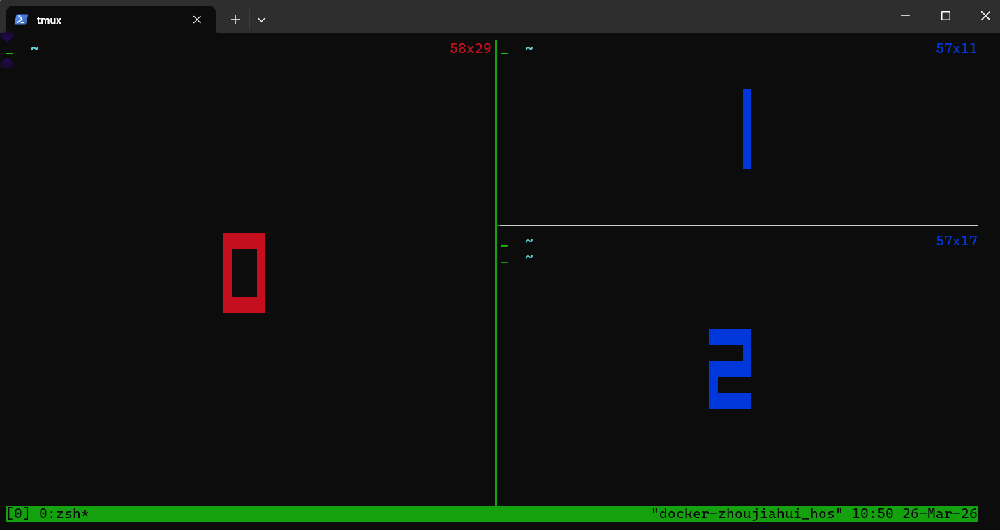
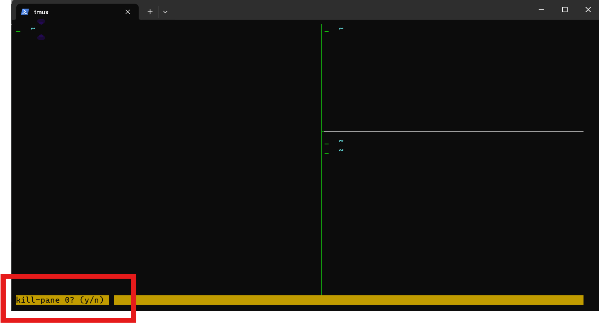
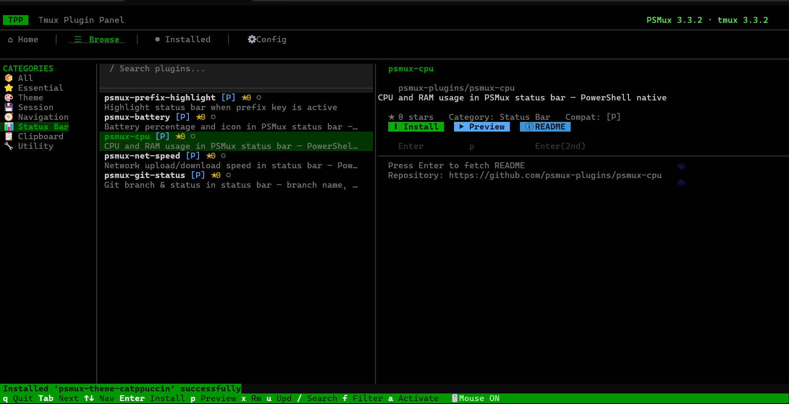

# Psmux 使用备忘

[Psmux](https://github.com/psmux/psmux) 是支持`windows`原生终端复用器，允许在一个终端窗口中创建多个会话、窗口和面板，支持会话**持久化**。适合远程连接服务器**运行长时间命令**，并且ssh连接断开/退出终端后执行的命令不会随着ssh连接断开而结束。

## 1. 安装

```pwsh
# 通过 winget 安装 也可以通过 Scoop/Chocolatey 等包管理器安装，具体参考github仓库教程：https://github.com/psmux/psmux
> winget install marlocarlo.psmux --source winget
已找到 psmux [marlocarlo.psmux] 版本 3.3.2
此应用程序由其所有者授权给你。
Microsoft 对第三方程序包概不负责，也不向第三方程序包授予任何许可证。
正在下载 https://github.com/psmux/psmux/releases/download/v3.3.2/psmux-v3.3.2-windows-x64.zip
  ██████████████████████████████  5.81 MB / 5.81 MB
已成功验证安装程序哈希
正在提取存档...
已成功提取存档
正在启动程序包安装...
添加了命令行别名： "psmux"
添加了命令行别名： "pmux"
添加了命令行别名： "tmux"
已修改路径环境变量；重启 shell 以使用新值。
已成功安装

# 验证安装
> psmux -V
psmux 3.3.2 # 输出版本号表示安装成功
```

## 2. 使用
### 2.1 前置键
`psmux`给命令起了别名`tmux`, 使用过程与`tmux`基本一致。
在`tmux`使用各自快捷键通常会有前置键，需要先按前置组合键，再配合对应命令键位，默认前缀键是: `Ctrl+B`。

例如：退出会话需要```Ctrl+B,  d```命令，先按下`Ctrl+B`键，再按下d键，就可以退出并不杀死会话。
**后续的命令中`, `表示分割，前后按键需要分两次操作。**

### 2.2 常用会话命令
- 新建会话：通过tmux直接打开一个会话窗口，这个窗口的命令在退出后会话不会关闭。
    ```bash
    # 新建会话
    tmux                      # 默认名称
    tmux new -s name          # 指定名称, 用于重新打开和kill
    ```

- 查看当前存在的会话:
    ```bash
    tmux ls
    ```

- 进入会话
    ```bash
    tmux attach               # 进入最近会话
    tmux attach -t name       # 进入指定会话
    tmux a -t name            # 简写
    ```

- 杀死会话
    ```bash
    tmux kill-session -t name # 关闭指定会话
    tmux kill-server # 关闭所有会话
    ```
- 退出会话 且不关闭
    ```bash
    Ctrl+B,  d
    ```
- 退出且关闭当前会话
    ```bash
    exit
    ```

### 2.3 Pane 分屏操作
- 上下分屏: `Ctrl+B,  %`
- 左右分屏: `Ctrl+B,  "`
- 移动当前光标到分屏：`Ctrl+B,  (← ↑ ↓ →)` 上下左右代表方向，每次按完方向键盘需要重新按前置键，不能连续选。
- 移动光标到指定分屏: `Ctrl+B,  q`，按完后会在分屏上出现数字，这时**快速按下对应数字**可实现光标直接跳转。
    
- 调整分屏大小：`Ctrl+B,  Ctrl + (← ↑ ↓ →)`，分别向上下左右四个方向跳转分屏大小。
- 关闭分屏：`Ctrl+B,  x`, 按完后需要再次输入y确认关闭光标所在分屏
  
- 鼠标模式：`Ctrl+B,  :set -g mouse on`, 这里按下前置键`Ctrl+B`后按`:`键，会出现一行黄色命令行，再输入`set -g mouse on`命令，并回车即可临时开启鼠标模式。 不开启鼠标模式通过鼠标滚轮无法上下查看shell输出。
    


## 3. TPM 插件管理器
`psmux`实现了一个类似于`tmux`的插件管理器`TPM`的工具[Tmux Plugin Panel](https://github.com/psmux/Tmux-Plugin-Panel)，可以通过它来安装和管理插件。

```powershell
# 同样可以通过多种包管理器安装，下面是通过 winget 安装的示例
> winget install marlocarlo.tmuxpanel --source winget
已找到 tmuxpanel [marlocarlo.tmuxpanel] 版本 0.1.1
此应用程序由其所有者授权给你。
Microsoft 对第三方程序包概不负责，也不向第三方程序包授予任何许可证。
正在下载 https://github.com/marlocarlo/Tmux-Plugin-Panel/releases/download/v0.1.1/tmuxpanel-v0.1.1-windows-x64.zip
  ██████████████████████████████  7.38 MB / 7.38 MB
已成功验证安装程序哈希
正在提取存档...
已成功提取存档
正在启动程序包安装...
添加了命令行别名： "tmuxpanel"
添加了命令行别名： "tmuxplugins"
添加了命令行别名： "tmuxthemes"
已成功安装
```
安装完成后通过下面三个命令打开插件面板，可以安装和管理插件。
- `tmuxpanel` — Main TUI plugin manager
- `tmuxplugins` — Opens directly to the Browse tab
- `tmuxthemes` — Opens directly to the Themes browser

以第二个命令为例，打开插件面板后可以通过`Browse`标签页浏览和安装插件，通过`Installed`标签页管理已安装的插件。

这里通过左右切换左边选项，上下切换插件列表，回车安装插件，可以按`p`预览对应插件，预览完成需要通过`exit`命令退出预览界面。

**Note**: 这里默认走系统代理的`7890`端口，通过设置环境变量好像无法修改代理地址和端口。

---

## 4. 参考链接
- [Psmux GitHub](https://github.com/psmux/psmux)
- [Tmux Plugin Panel](https://github.com/psmux/Tmux-Plugin-Panel)]
- [Tmux GitHub](https://github.com/tmux/tmux)
- [Tmux 参考tutorial](https://www.ruanyifeng.com/blog/2019/10/tmux.html)
- [Tmux 快捷键](https://tmuxcheatsheet.com/)

