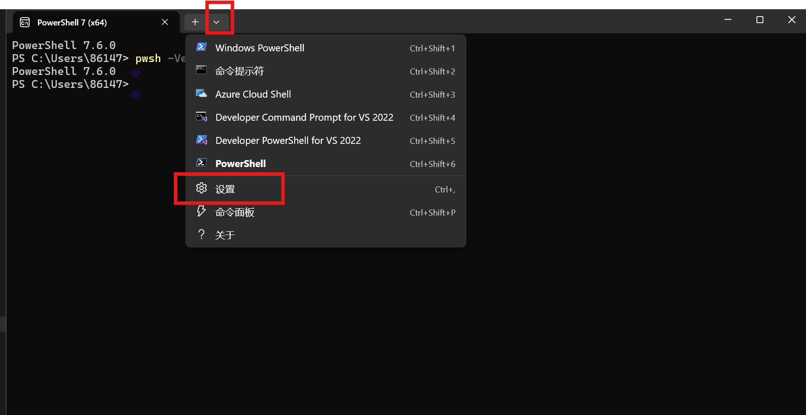
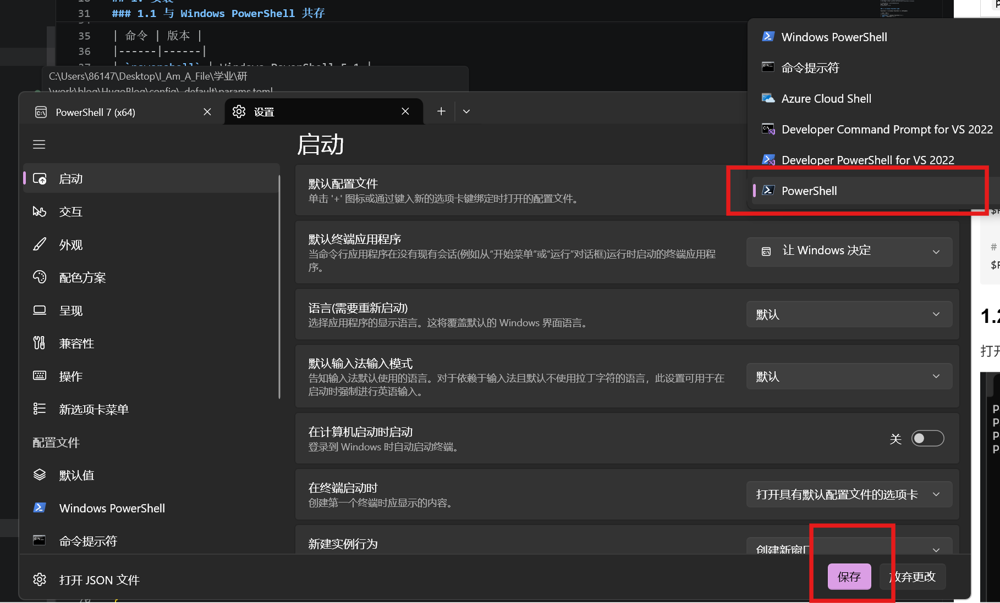

# PowerShell 7 迁移备忘

PowerShell 7 (pwsh) 是 PowerShell 的跨平台版本，相比 Windows PowerShell 5.1 有更好的性能、新特性和跨平台支持，并且支持更多功能。如**命令补全**等，本文记录迁移过程。

## 1. 安装
```powershell
# 使用 winget 安装
winget install Microsoft.PowerShell --source winget

# 或使用 MSI 安装包 注意这里要下载64位版本
# 下载地址: https://github.com/PowerShell/PowerShell/releases

# 验证安装，打开pwsh7终端输入命令
pwsh -Version
# PowerShell 7.6.0
```

### 1.1 与 Windows PowerShell 共存

PowerShell 7 与 Windows PowerShell 5.1 可以共存：

| 命令 | 版本 |
|------|------|
| `powershell` | Windows PowerShell 5.1 |
| `pwsh` | PowerShell 7.x |

其配置文件路径不同，迁移可以参考[官方指南](https://learn.microsoft.com/zh-cn/powershell/scripting/whats-new/migrating-from-windows-powershell-51-to-powershell-7?view=powershell-7.5)。

```powershell
# 查看当前配置文件路径
$PROFILE

# 查看所有配置文件路径
$PROFILE | Format-List -Force
```

### 1.2 设置为默认终端
打开`pwsh7`终端，点击设置，

将`pwsh7`设置为默认终端，并且保存。

在这个设置中可以对 `PowerShell 7` 的外观、字体、配色方案等进行个性化配置。

### 1.3 VSCode

在 `VSCode` 中通过`Ctrl+Shift+P`打开命令面板, 搜索并进入`Preferences: Open User Settings (JSON)`，在 `settings.json` 中查找配置，
需要为`terminal.integrated.profiles.windows`添加`PowerShell 7`的路径配置，通常情况路径是` "C:\\Program Files\\PowerShell\\7\\pwsh.exe"`,  可以用`where.exe pwsh`命令查找：
另外把默认终端设置为`PowerShell 7`，保存后即可。

```json
    "terminal.integrated.profiles.windows": {
        "PowerShell 7": {   // 配置 PowerShell 7 终端路径
            "path": "C:\\Program Files\\PowerShell\\7\\pwsh.exe", 
        },  
    }
    "terminal.integrated.defaultProfile.windows": "PowerShell 7" // 设置默认终端
```

## 2. 常用 Windows 命令

### 2.1 文件操作

```powershell
# 查看文件/目录
Get-ChildItem          # 别名: ls,  dir
Get-ChildItem -Force   # 显示隐藏文件
Get-ChildItem -Recurse # 递归查看

# 查看文件内容
Get-Content file.txt   # 别名: cat,  type
Get-Content file.txt -Head 10  # 前 10 行
Get-Content file.txt -Tail 10  # 后 10 行

# 复制/移动/删除
Copy-Item src dst      # 别名: cp,  copy
Move-Item src dst      # 别名: mv,  move
Remove-Item path       # 别名: rm,  del
Remove-Item -Recurse -Force dir  # 强制删除目录

# 创建
New-Item -ItemType File -Name "file.txt"
New-Item -ItemType Directory -Name "newdir"  # 别名: mkdir
```

### 2.2 进程管理

```powershell
# 查看进程
Get-Process            # 别名: ps
Get-Process | Sort-Object CPU -Descending | Select-Object -First 10

# 查找进程
Get-Process -Name "chrome"

# 杀进程
Stop-Process -Id 1234
Stop-Process -Name "chrome"
Get-Process "node" | Stop-Process
```

### 2.3 服务管理

```powershell
# 查看服务
Get-Service
Get-Service -Name "mysql*"

# 启动/停止/重启
Start-Service -Name "mysql"
Stop-Service -Name "mysql"
Restart-Service -Name "mysql"

# 设置启动类型
Set-Service -Name "mysql" -StartupType Automatic
```

### 2.4 网络相关

```powershell
# 查看网络配置
Get-NetIPConfiguration
Get-NetIPAddress

# 查看端口占用
Get-NetTCPConnection -LocalPort 8080
Get-Process -Id (Get-NetTCPConnection -LocalPort 8080).OwningProcess

# 测试网络
Test-NetConnection baidu.com
Test-NetConnection -ComputerName baidu.com -Port 443

# DNS 解析
Resolve-DnsName baidu.com
```

### 2.5 系统信息

```powershell
# 系统信息
Get-ComputerInfo
$PSVersionTable        # PowerShell 版本

# 磁盘空间
Get-PSDrive -PSProvider FileSystem
Get-Volume

# 环境变量
$env:PATH
$env:JAVA_HOME
[Environment]::GetEnvironmentVariable("PATH",  "User")

# 设置环境变量
$env:MY_VAR = "value"
[Environment]::SetEnvironmentVariable("MY_VAR",  "value",  "User")
```

### 2.6 压缩解压

```powershell
# 压缩
Compress-Archive -Path "folder" -DestinationPath "archive.zip"

# 解压
Expand-Archive -Path "archive.zip" -DestinationPath "output"
```

### 2.7 实用技巧

```powershell
# 查找文件
Get-ChildItem -Recurse -Filter "*.py" | Select-Object FullName

# 搜索文件内容
Select-String -Path "*.py" -Pattern "import"

# 剪贴板
Set-Clipboard "复制内容"   # 别名: scb
Get-Clipboard             # 别名: gcb

# 执行命令并获取输出
Invoke-Expression "echo hello"
Invoke-WebRequest "https://example.com"  # 别名: curl,  wget
```

---

## 3. 参考链接

- [PowerShell GitHub](https://github.com/PowerShell/PowerShell)
- [PowerShell 文档](https://learn.microsoft.com/powershell/)
- [PowerShell 7 新特性](https://learn.microsoft.com/powershell/scripting/whats-new/what-s-new-in-powershell-7)
- [从 Windows PowerShell 迁移](https://learn.microsoft.com/powershell/scripting/whats-new/migrating-from-windows-powershell-51-to-powershell-7)

