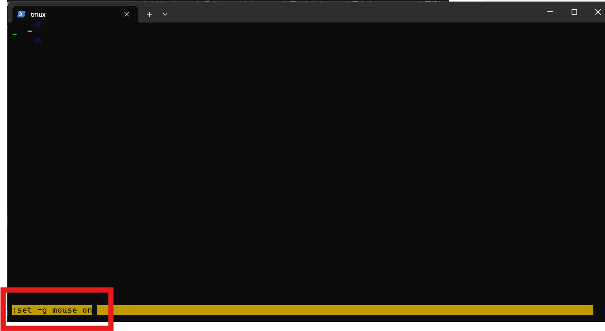

# Tmux 使用备忘

[Tmux](https://github.com/tmux/tmux) (Terminal Multiplexer) 是一个终端复用器，允许在一个终端窗口中创建多个会话、窗口和面板，支持会话**持久化**。适合远程连接服务器**运行长时间命令**，并且ssh连接断开后执行的命令不会随着ssh连接断开而结束。

## 1. 安装

```bash
# Ubuntu/Debian
sudo apt install -y tmux

# 验证安装
tmux -V
# tmux 3.2a # 输出版本号表示安装成功
```

## 2. 使用
### 2.1 前置键
tmux中使用各自快捷键通常会有前置键，需要先按前置组合键，再配合对应命令键位，默认前缀键是: `Ctrl+B`。

例如：退出会话需要```Ctrl+B, d```命令，先按下`Ctrl+B`键，再按下d键，就可以退出并不杀死会话。
**后续的命令中`,`表示分割，前后按键需要分两次操作。**

### 2.2 常用会话命令
- 新建会话：通过tmux直接打开一个会话窗口，这个窗口的命令在退出后会话不会关闭。
    ```bash
    # 新建会话
    tmux                      # 默认名称
    tmux new -s name          # 指定名称,用于重新打开和kill
    ```

- 查看当前存在的会话:
    ```bash
    tmux ls
    ```

- 进入会话
    ```bash
    tmux attach               # 进入最近会话
    tmux attach -t name       # 进入指定会话
    tmux a -t name            # 简写
    ```


- 杀死会话
    ```bash
    tmux kill-session -t name # 关闭指定会话
    tmux kill-server # 关闭所有会话
    ```
- 退出会话 且不关闭
    ```bash
    Ctrl+B, d
    ```
- 退出且关闭当前会话
    ```bash
    exit
    ```

### 2.3 Pane 分屏操作
- 上下分屏: `Ctrl+B, %`
- 左右分屏: `Ctrl+B, "`
- 移动当前光标到分屏：`Ctrl+B, (← ↑ ↓ →)` 上下左右代表方向，每次按完方向键盘需要重新按前置键，不能连续选。
- 移动光标到指定分屏: `Ctrl+B, q`，按完后会在分屏上出现数字，这时**快速按下对应数字**可实现光标直接跳转。
    
- 调整分屏大小：`Ctrl+B, Ctrl + (← ↑ ↓ →)`，分别向上下左右四个方向跳转分屏大小。
- 关闭分屏：`Ctrl+B, x`,按完后需要再次输入y确认关闭光标所在分屏
  
- 鼠标模式：`Ctrl+B, :set -g mouse on`,这里按下前置键`Ctrl+B`后按`:`键，会出现一行黄色命令行，再输入`set -g mouse on`命令，并回车即可临时开启鼠标模式。 不开启鼠标模式通过鼠标滚轮无法上下查看shell输出。
    

---

## 参考链接
- [Tmux GitHub](https://github.com/tmux/tmux)
- [Tmux 参考教程](https://www.ruanyifeng.com/blog/2019/10/tmux.html)
- [Tmux 快捷键](https://tmuxcheatsheet.com/)