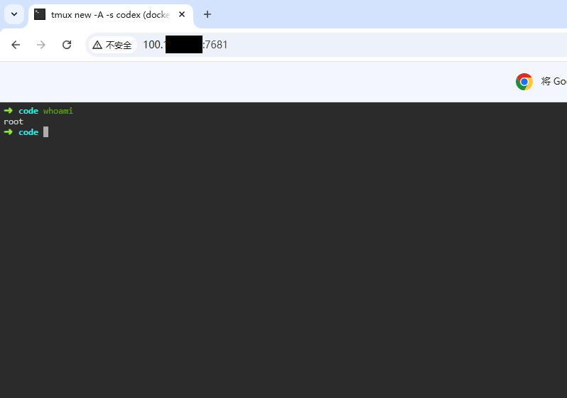
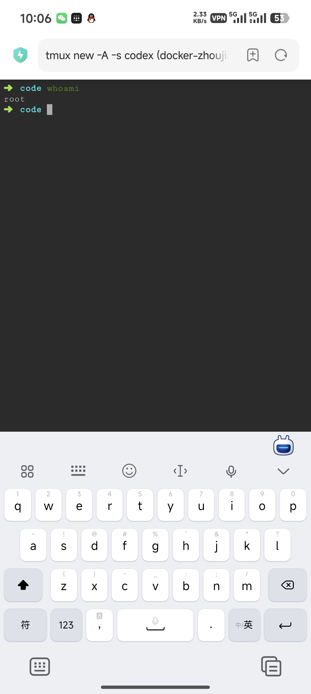

# ttyd 使用备忘

临时使用手机连接服务器上的 Codex，会碰到两个问题：

- 远程桌面在手机上比例差不顺手
- 纯 SSH 连接使用tmux退出的前置键位等操作不顺手

可以使用下面方案：

`tmux + ttyd + Tailscale`

思路很直接：

1. 用 `tmux` 承载 Codex 会话
2. 用 `ttyd` 把这段终端会话变成网页
3. 用 `Tailscale` 把访问范围限制在自己的 tailnet 内
4. 手机上直接打开网页终端连接

## 1. 准备 tmux

建议 Codex 跑在独立会话里：

```bash
tmux new -A -s codex
```

这样你电脑上 SSH 连进去可以接管，手机上通过 `ttyd` 打开网页也能接管，核心会话始终是同一个。

## 2. 准备 ttyd

### 2.1 安装
[ttyd](https://github.com/tsl0922/ttyd) 是一个把终端共享成 Web 页面的工具。

- Linux 安装：
```bash
sudo apt install ttyd -y
ttyd -v
# ttyd version 1.6.3 # 输出版本号表示安装成功
```
- Windows 安装：
```powershell
scoop install ttyd
ttyd -v
# ttyd version 1.7.7-40e79c7 # 输出版本号表示安装成功
```

### 2.2 最小可用命令

先直接起一个最小服务：

```bash
# 可选是否使用认证
ttyd -p 7681 -c admin:admin123 tmux new -A -s codex
ttyd -p 7681 tmux new -A -s codex
```

其中：

- `-p 7681`：监听端口
- `-c admin:admin123`：开启基础认证, 用户名是 `admin`，密码是 `admin123`
- `tmux new -A -s codex`：把网页终端连接到 `codex` 这个 tmux 会话

然后在浏览器打开：

```text
# 注意这里需要填当前浏览器设备可访问的服务器 IP 地址
http://服务器IP:7681
```


## 3. Tailscale 控制连接
`Tailscale` 能让分布在不同网络下的设备通过身份认证安全地组成一个局域网，实现内网穿透和直接访问。

### 3.1 安装
- Linux：`Tailscale` 内核模式依赖 `TUN`，通常需要宿主机管理员权限。
    ```bash
    curl -fsSL https://tailscale.com/install.sh | sh
    # 启动服务
    sudo tailscale up
    # 接着会输出一个登录链接，复制到浏览器里登录后服务器就加入了你的 tailnet
    ```
  - 无 `TUN` 模式：
  ```bash
    curl -fsSL https://tailscale.com/install.sh | sh
    # 安装完后分别在两个 shell 执行
    tailscaled \
        --tun=userspace-networking \
        --socks5-server=127.0.0.1:1055 \
        --outbound-http-proxy-listen=127.0.0.1:1055
    tailscale up
    # 接着会输出一个登录链接，复制到浏览器里登录后服务器就加入了你的 tailnet

    # 无 TUN 模式下，应用不会自动走 Tailscale，要显式走代理
    # 例如
    export ALL_PROXY=socks5://127.0.0.1:1055
    export HTTP_PROXY=http://127.0.0.1:1055
    export HTTPS_PROXY=http://127.0.0.1:1055
    ```
- Windows：
  - 直接从 [Tailscale 官网](https://tailscale.com/download/windows) 下载 Windows 安装包，安装后登录即可。

- Android：
  - Google Play 可用：直接从 `Google Play` 安装 Android 客户端。
  - Google Play 不可用：从 [Tailscale](https://github.com/tailscale/tailscale-android) 官方提供的 [Android APK](https://pkgs.tailscale.com/stable/#android) 手动安装。


### 3.2 网络连接
服务器可能在内网环境，不具有公网 IP，通过 `Tailscale` 可以让同一 `tailnet` 内的设备访问这个服务。

1. `ttyd` 只监听 `127.0.0.1`
2. 用 `tailscale serve` 把本地端口暴露给 tailnet 内的设备

- 启动 `ttyd`：

```bash
ttyd -i 127.0.0.1 -p 7681 tmux new -A -s codex
```
- 随后服务器和访问设备都启动 `Tailscale`，并加入同一个 `tailnet`，就可以从访问设备访问服务器上的 `ttyd` 服务：
```bash
# Linux 上通过命令查找 Tailscale 分配的 IP 地址，例如
➜ tailscale ip
100.xx.xx.60
# Windows / Android 上可以在客户端界面查看分配的 IP 地址

# 在访问设备上打开浏览器访问
100.xx.xx.60:7681
# [可选]输入用户名和密码
```
- Windows 连接：

- Android 连接：


问题记录：
- `-c` 认证可以访问 `token`，但在部分浏览器里可能无法正常建立连接。
- 默认前端 `xterm.js` 在 `Android` 设备上可能出现渲染问题，可以尝试 `-t rendererType=canvas`。

## 参考链接

- [ttyd GitHub](https://github.com/tsl0922/ttyd)
- [Tailscale 下载页](https://tailscale.com/download)
- [Tailscale Android 下载页](https://tailscale.com/download/android)
- [Tailscale Android 仓库](https://github.com/tailscale/tailscale-android)
- [Tailscale Serve 命令](https://tailscale.com/kb/1242/tailscale-serve)
- [Tailscale Serve 功能说明](https://tailscale.com/docs/features/tailscale-serve)
