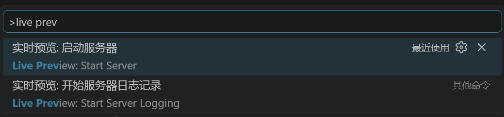
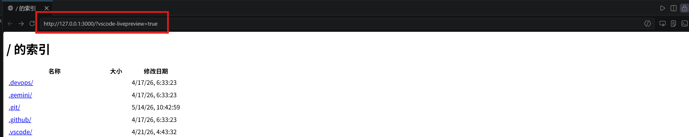
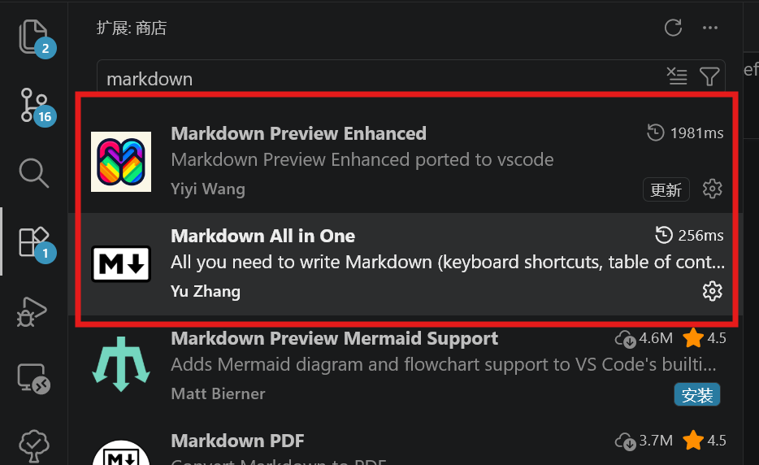
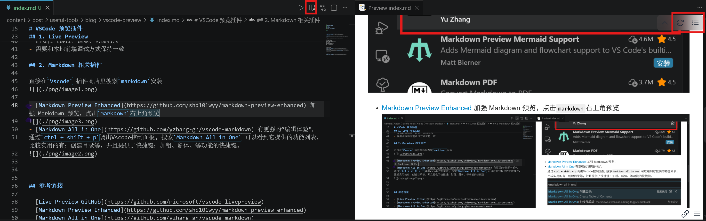
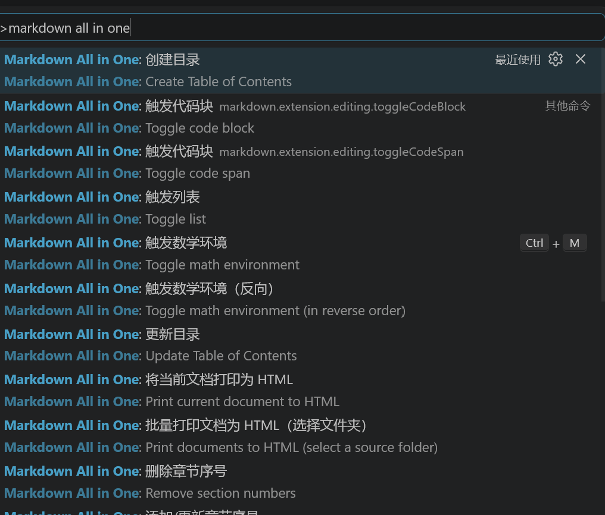

# VSCode 预览插件

这里整理几个在 VSCode 里比较常用的预览相关插件。

- `Live Preview`: 在浏览器里实时预览 Markdown 和 HTML
- `Markdown Preview Enhanced`: 增强 Markdown 预览，支持公式、Mermaid等
- `Markdown All in One`: 增强 Markdown 编辑体验，支持列表、目录、快捷键等

## 1. Live Preview

[Live Preview](https://github.com/microsoft/vscode-livepreview) 适合在 VSCode 里快速起一个预览服务，通过`ctrl+shift+p`打开`Vscode`命令面板，输入`Live Preview: Start Server`进行启动

随后可以直接打开服务器上部署的**静态**网页，

## 2. Markdown 相关插件

直接在`Vscode` 插件商店里搜索`markdown`安装

- [Markdown Preview Enhanced](https://github.com/shd101wyy/markdown-preview-enhanced) 加强 Markdown 预览，点击`markdown`文件的右上角可以预览，在预览界面可以刷新/显示标题大纲。

- [Markdown All in One](https://github.com/yzhang-gh/vscode-markdown) 有更强的“编辑体验”，
通过`ctrl + shift + p`调出Vscode控制面板, 搜索`Markdown All in One` 可以看到它提供的功能列表，比较实用的有：创建目录等，并且提供了快捷键：加粗、斜体、等功能的快捷键。

## 参考链接

- [Live Preview GitHub](https://github.com/microsoft/vscode-livepreview)
- [Markdown Preview Enhanced](https://github.com/shd101wyy/markdown-preview-enhanced)
- [Markdown All in One](https://github.com/yzhang-gh/vscode-markdown)
