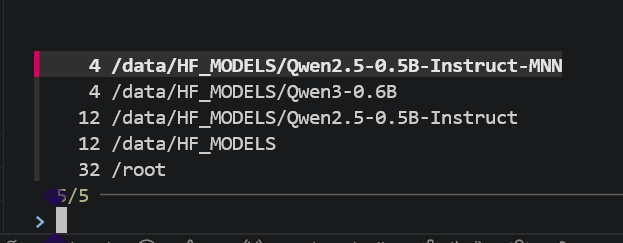

# Zoxide 使用备忘

[Zoxide](https://github.com/ajeetdsouza/zoxide) 是一个更智能的 `cd` 命令，它会记住你经常访问的目录，让你可以用简短的别名快速跳转。用 Rust 编写，速度快于`zsh z`插件。

## 1. 安装

```bash
# Ubuntu/Debian
sudo apt install zoxide -y
```

## 2. 配置

在 shell 配置文件中添加初始化命令：

```bash
# 添加 zoxide 初始化命令到 ~/.zshrc
echo 'eval "$(zoxide init zsh)"' >> ~/.zshrc
# 从zshrc 配置文件中移除z插件
# 移除前
plugins=(git sudo z zsh-syntax-highlighting zsh-autosuggestions fzf)
# 移除后
plugins=(git sudo zsh-syntax-highlighting zsh-autosuggestions fzf)

# 具体操作
vim ~/.zshrc
/plugins= # 命令模式直接输入前面字符串 然后回车 表示搜索这个命令
# 进入编辑模式删除z插件
# 保存退出 (:wq)
source ~/.zshrc # 使配置生效
```


## 3. 基本使用
### 3.1 项目快速跳转

```bash
# 第一次访问
cd ~/work/blog/HugoBlog

# 之后只需
z hugo        # 跳转到 HugoBlog
z blog        # 跳转到 blog 相关目录
z hu blog     # 多关键字精确匹配
```
### 3.2 可视化
通过`zi`命令可以列出匹配的目录，上下选择进行跳转：
```bash
zi path   # 列出匹配路径，选择跳转
```


### 3.2 管理数据库

```bash
# 添加目录到数据库
zoxide add /path/to/dir

# 从数据库移除目录
zoxide remove /path/to/dir

# 查看数据库中的目录
zoxide query -l

# 查看数据库路径
zoxide query -l --exclude .

# 清空数据库
zoxide query --purge
```

## 3.3 工作原理

Zoxide 会记录每个目录的访问频率和最近访问时间，计算出一个"分数"：

- 访问越频繁，分数越高
- 最近访问的目录分数更高
- 跳转时优先选择分数最高的匹配目录

数据库存储在 `~/.local/share/zoxide/db.zo`（Linux）或 `~/.zoxide/db.zo`（macOS）。

---

## 参考链接

- [Zoxide GitHub](https://github.com/ajeetdsouza/zoxide)
